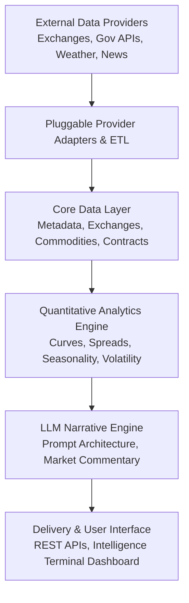

<p align="center">
  
</p>

<h1 align="center">Commodity Market Intelligence & Quantitative Platform</h1>

<p align="center">
  <strong>Institutional Quantitative Research, Forward Curve Analytics, Multi-Exchange Arbitrage & AI Market Narratives</strong>
</p>

<p align="center">
  <a href="https://nansari-0134.github.io/commodity-market-smart-analyst/">
    
  </a>
  
  
  
</p>

<p align="center">
  <a href="https://nansari-0134.github.io/commodity-market-smart-analyst/">
    <strong>📖 Open Full Documentation & Interactive REST API Reference →</strong>
  </a>
</p>

---

> [!WARNING]
> **Regulatory Notice & Standard Disclaimer**:
> This platform is strictly an analytical research, quantitative workflow, and market surveillance tool. It does **NOT** provide financial advice, investment recommendations, buy/sell signals, or "trading calls." All market models, forward curves, balance sheets, and LLM-generated narratives are for institutional informational and workflow automation purposes only.

---

## System Overview

This platform is an institutional-grade quantitative intelligence and narrative automation system designed for global physical commodities and financial derivatives.



### The 4 Core Architectural Directives
1. **Source Independence (Pluggable Adapters)**: Business logic, database schemas, and analytics are strictly agnostic to external data vendors. All feeds connect via Strategy + Factory interfaces (`BaseProvider`).
2. **Point-in-Time Correctness (Zero Lookahead Bias)**: Data ingestion, government balance sheets (WASDE, EIA), and revisions preserve exact observation and publication timestamps via `PointInTimeModel`.
3. **Deterministic Mathematics Before LLM Reasoning**: Forward curves, crack/crush spreads, carrying charges, and unit conversions (`UnitMaster.convert_to()`) are computed deterministically. The LLM reasons over verified facts.
4. **Institutional Precision**: Models ISO 10383 Market Identifier Codes (MICs), IANA timezones, exchange holiday trading vs. settlement rules, and physical deliverable chemistry standards.

---

## Phased Roadmap & Current Status

| Phase | Subsystem Module | Scope & Key Capabilities | Status | Documentation |
| :---: | :--- | :--- | :---: | :---: |
| **01** | **Core Infrastructure** | Django 5.2, PostgreSQL, Celery/Redis, Point-in-Time Models, Health APIs | :white_check_mark: Active | [Architecture](https://nansari-0134.github.io/commodity-market-smart-analyst/modules/core-infrastructure/) |
| **02** | **Metadata Taxonomy & Units** | 34 Data Domains, 45 Units of Measure, Deterministic Math Engine, 15 Frequencies | :white_check_mark: Active | [Taxonomy](https://nansari-0134.github.io/commodity-market-smart-analyst/modules/taxonomy-and-units/) |
| **03** | **Exchanges & Calendars** | 15 Global Venues, 18 Sessions, Civic vs. Trading Calendars, Settlement Roll Rules | :white_check_mark: Active | [Exchange Master](https://nansari-0134.github.io/commodity-market-smart-analyst/modules/exchanges-and-calendars/) |
| **04** | **Commodity Master** | 23 Benchmark Assets, 44 Multi-Exchange Listings, Chemistry Standards, Hubs | :white_check_mark: Active | [Commodity Master](https://nansari-0134.github.io/commodity-market-smart-analyst/modules/commodity-master/) |
| **05** | **Futures & Derivatives** | Contract Specifications, Expiry Engine (F-Z), Active Expiries, Roll Schedules | :construction: **Current** | [Contracts](https://nansari-0134.github.io/commodity-market-smart-analyst/api/contracts/) |
| **06** | **Dataset Master** | Dataset Catalog, Update Cadences, Data Contracts, Ingestion Schedulers | :soon: Planned | Planned |
| **07** | **Variable Master** | Standard Variable Catalog, Transformation Rules | :soon: Planned | Planned |
| **08** | **Provider Master** | Vendor Directory, Credential Vault, Rate Limiting, Failover Priority | :soon: Planned | Planned |
| **09** | **Endpoint & API Metadata** | Provider Endpoint Schemas, HTTP Parameter Mappings | :soon: Planned | Planned |
| **10** | **Data Contracts** | Schema Validation Rules, Nullability, Tolerances, Ingestion Alerts | :soon: Planned | Planned |
| **11+**| **Quant & LLM Engines** | Forward Curves, Balance Sheets, Knowledge Graph, RAG, Market Narratives | :soon: Planned | Planned |

---

## Interactive REST API Directory

| Domain | Endpoint | Method | Key Capabilities |
| :--- | :--- | :---: | :--- |
| **Commodity Catalog** | `/api/commodities/` | `GET` | Paginated catalog with sector, group, settlement, and venue filters. |
| **Commodity Profile** | `/api/commodities/{code}/` | `GET` | Full profile with deliverable chemistry, delivery hubs, and multi-venue listings. |
| **Exchange Listings** | `/api/commodities/{code}/listings/` | `GET` | Active multi-exchange contracts with daily volume and open interest. |
| **Commodity Summary** | `/api/commodities/summary/` | `GET` | Statistical overview by sector, physical vs. cash split, and venue rankings. |
| **Exchange Venues** | `/api/exchanges/` | `GET` | 15 Global exchanges (CME, NYMEX, COMEX, ICE, LME, BMD, MCX, SGX, etc.). |
| **Exchange Calendars** | `/api/exchanges/{code}/is-trading-day/` | `GET` | Real-time diagnostic evaluation of trading vs settlement status. |
| **Data Domains** | `/api/metadata/domains/` | `GET` | 34 Canonical commodity domains with parent-child hierarchy. |
| **Units of Measure** | `/api/metadata/units/` | `GET` | 45 Physical and financial units with mathematical conversion factors. |
| **System Diagnostics** | `/api/health/` | `GET` | Live PostgreSQL/database connectivity and engine health probe. |

*Full API documentation with interactive cURL and Python code snippets is available at the [REST API Reference](https://nansari-0134.github.io/commodity-market-smart-analyst/api/overview/).*

---

## Local Development & Operations

### 1. Prerequisites & Environment Setup
```powershell
# Clone the repository
git clone https://github.com/nansari-0134/commodity-market-smart-analyst.git
cd commodity-market-smart-analyst

# Activate virtual environment
.\.venv\Scripts\Activate.ps1
```

### 2. Database Migrations & Data Seeding
```powershell
# Apply database migrations
python manage.py migrate

# Seed canonical master data
python manage.py seed_metadata      # Phase 2: 34 Domains, 45 Units, 15 Frequencies
python manage.py seed_exchanges     # Phase 3: 15 Venues, 18 Sessions, Calendars
python manage.py seed_commodities   # Phase 4: 23 Commodities, 44 Multi-Venue Listings
```

### 3. Run Development Servers
```powershell
# Start Django Terminal Dashboard (http://127.0.0.1:8000)
python manage.py runserver 127.0.0.1:8000

# Start Local MkDocs Documentation with Live Reload (http://127.0.0.1:8001)
mkdocs serve --dev-addr 127.0.0.1:8001
```

### 4. Automated Testing
```powershell
# Run the complete test suite (27 passing tests)
pytest tests/ -v
```

---

## Documentation Deployment

The documentation site is built with MkDocs Material and automatically deployed to GitHub Pages:

```powershell
# Verify strict documentation build (0 broken links, 0 warnings)
mkdocs build --strict

# Deploy to GitHub Pages
mkdocs gh-deploy
```

Live documentation URL: **[https://nansari-0134.github.io/commodity-market-smart-analyst/](https://nansari-0134.github.io/commodity-market-smart-analyst/)**
