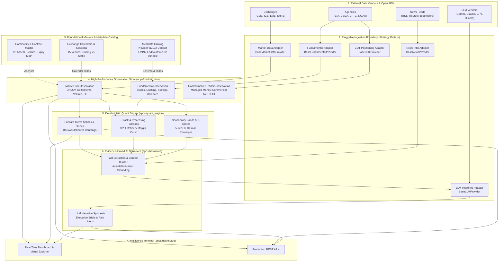

# Chapter 1: End-to-End System Execution Flow

The **Commodity Market Intelligence Platform** operates as a deterministic, point-in-time analytical pipeline that transforms raw multi-source market inputs into actionable quantitative research and fact-anchored AI narratives.

This dedicated master flow document traces **how data and execution travel through the entire system**, defining every module's role, transformations, and direct configuration links for swapping providers.

---

## 1. High-Level System Architecture Diagram



---

## 2. Module Execution Walkthrough

The platform executes across **7 coordinated lifecycle phases**. Below is the exact operational responsibility of each module, its inputs and outputs, and the direct link to change or swap its underlying source:

```
[Phase A: Ground Rules]       Taxonomy & Exchange Calendars (Apps: metadata, exchanges)
        \u2502
[Phase B: Physical & Derivs]   Asset Master & Contract Specs (Apps: commodities, contracts)
        \u2502
[Phase C: Metadata Registry]   Data Map: Who \u2192 What \u2192 Where \u2192 Which (Apps: providers, datasets, endpoints, variables)
        \u2502
[Phase D: Ingestion Store]     Point-in-Time Observations (App: market_data)
        \u2502
[Phase E: Quant Analytics]     Forward Curves, Spreads & Seasonality (App: quant_engine)
        \u2502
[Phase F: News & Catalysts]    Event Calendar & Entity Tagging (App: news_intel)
        \u2502
[Phase G: AI Intelligence]     Fact-Anchored LLM Narratives (App: narratives)
```

---

### Step 1: Foundational Taxonomy & Units (`apps/metadata`)
* **What it does**: Provides standard Units of Measure (UOM), observation frequencies, and dimensional mathematical conversion.
* **Why it matters**: Deterministic math **must** precede all analysis. Converting 1 Barrel of Crude Oil to Metric Tons or Gallons is strictly calculated using `UnitMaster.convert_to()` before any quantitative model or LLM touches the number.
* **Key Output**: 50 canonical units, 34 data domains, 15 observation intervals.

---

### Step 2: Global Exchanges & Trading Calendars (`apps/exchanges`)
* **What it does**: Models 15 global commodity exchanges (CME, ICE, LME, SHFE, SGX, etc.), 18 operating trading sessions, and institutional holiday calendars.
* **Why it matters**: Resolves whether a date is an active trading day vs. cash settlement day. Accounts for regional holiday differences (e.g. Good Friday in the US vs. Lunar New Year in China).
* **Actionable Link**:
  > **Need to add or change an Exchange Calendar Source?**  
  > See: [How to Change Calendar Data Sources](guides/data-sources.md#7-how-to-swap-exchange-calendar-providers-step-by-step).

---

### Step 3: Physical Commodities & Derivative Contracts (`apps/commodities`, `apps/contracts`)
* **What it does**: 
  - `CommodityMaster`: Standardizes physical specifications (API gravity, sulfur content, delivery hubs, crop planting calendars).
  - `ContractSpecification`: Models derivative contract specifications, F-Z standardized month codes, algorithmic expiry date calculations, and benchmark index roll schedules (S&P GSCI, Bloomberg BCOM).
* **Key Output**: 23 physical benchmark commodities and 25 derivative contract specifications with algorithmic last trade date calculations.

---

### Step 4: Metadata Catalog & Feature Registry (`apps/providers`, `apps/datasets`, `apps/endpoints`, `apps/variables`)
* **What it does**: Establishes the canonical 4-tier data dictionary that tracks data lineage:
  ```
  ProviderMaster (WHO: The Vendor, e.g. EIA, CME, USDA)
     \u2193
  DatasetMaster (WHAT: The Report/Table, e.g. Weekly Petroleum Status Report)
     \u2193
  EndpointMaster (WHERE: The URL & Protocol, e.g. /v2/petroleum/pri/spt/data)
     \u2193
  VariableMaster (WHICH: The Observable Metric, e.g. CRUDE_CUSHING_STOCKS)
  ```
* **Actionable Links**:
  > **Need to add a brand-new feature or metric to the platform?**  
  > See: [How to Add New Features, Datasets & Variables in 2 Minutes](guides/adding-new-feature.md).

---

### Step 5: Ingestion & Time-Series Observation Store (`apps/market_data`)
* **What it does**: The quantitative storage layer ingesting and indexing point-in-time time-series:
  - `MarketPriceObservation`: High-frequency and daily OHLCV, settlement prices, open interest, and volume.
  - `FundamentalObservation`: Government storage balances, weekly inventory changes, refinery runs.
  - `CommitmentOfTradersObservation`: CFTC institutional trader positioning (Managed Money Net, Commercial Net, % of Open Interest).
* **Rule 2 & Rule 5 Guarantees**:
  - Point-in-time correctness: Every observation tracks `observation_date` (market trade date) and `publication_time` (official UTC release timestamp).
  - Native SQL `NULL` for missing metrics: Preserves exact zero (`0.0`) vs unobserved (`NULL`), accelerating SIMD vectorized analytics in NumPy/Pandas.
* **Actionable Links**:
  > **Need to switch your Market Data feed (e.g. from Static/Yahoo to CME Datamine or Bloomberg)?**  
  > See: [How to Swap Market Data Providers](guides/data-sources.md#3-how-to-swap-market-data-providers-step-by-step).  
  > **Need to switch your Fundamental data source (e.g. from EIA to Kpler or Vortexa)?**  
  > See: [How to Swap Fundamental Data Providers](guides/data-sources.md#4-how-to-swap-fundamental-data-providers-step-by-step).

---

### Step 6: Deterministic Quantitative Research Engine (`apps/quant_engine` — Phase 11)
* **What it does**: Calculates forward curves, backwardation/contango slopes, term structure splines, crack/crush spreads (e.g. 3:2:1 refinery margin), and 5-year historical seasonality envelopes.
* **Why it matters**: All math is purely deterministic. The LLM is never allowed to "guess" or "hallucinate" forward curve slopes; the quant engine outputs verified feature arrays.
* **Inputs**: Point-in-time observations from `apps/market_data`.
* **Outputs**: Continuous forward curves, rolling z-scores, seasonal band deviations.

---

### Step 7: News, Sentiment & Macro Catalysts (`apps/news_intel` — Phase 12)
* **What it does**: Ingests macroeconomic catalyst events (OPEC meetings, USDA WASDE releases, Fed interest rate decisions) and real-time news headlines, automatically linking entities to canonical commodities via regex and NLP rules.
* **Actionable Link**:
  > **Need to switch your News or Sentiment Feed (e.g. from RSS to Bloomberg News or AlphaVantage)?**  
  > See: [How to Swap News and Sentiment Providers](guides/data-sources.md#5-how-to-swap-news-and-sentiment-providers-step-by-step).

---

### Step 8: Evidence-Linked AI Market Narratives (`apps/narratives` — Phase 13)
* **What it does**: Generates executive morning market briefs, supply/demand balance commentary, and risk surveillance summaries.
* **Anti-Hallucination Standard**:
  - The context builder collects verified quantitative metrics (e.g. Cushing stocks: 24.5M bbls, 1-week diff: -1.2M bbls, prompt WTI: $75.85, COT Managed Money Net: +155k).
  - The LLM reasons *over* these ground-truth figures using a structured prompt template.
* **Actionable Link**:
  > **Need to change the LLM Provider or Model (e.g. switch from Gemini to Claude, GPT-4o, or local Ollama)?**  
  > See: [How to Swap LLM Models and Providers](guides/data-sources.md#6-how-to-swap-llm-models-and-providers-step-by-step).

---

### Step 9: Surveillance Terminal & Production REST APIs (`apps/dashboard`, Production APIs)
* **What it does**:
  - **Intelligence Terminal**: High-density dark-theme dashboard displaying system health, asset tickers, pipeline ingestion status, and visual data explorer (`/explorer/`).
  - **REST API Suite**: Complete set of programmatic JSON endpoints for consumption by quants, external microservices, and web frontend applications.

---

## 3. Summary of Configuration Knobs

To configure or swap any layer of the execution pipeline, update `.env` or Django settings:

```bash
# -------------------------------------------------------------
# PLUGGABLE PROVIDER CONFIGURATION (.env)
# -------------------------------------------------------------
# Market Price Data: 'static', 'yahoo', 'cme_datamine', 'interactive_brokers'
MARKET_DATA_PROVIDER=static

# Fundamental Balances: 'static', 'eia_api', 'kpler', 'usda'
FUNDAMENTAL_DATA_PROVIDER=static

# Commitment of Traders (COT): 'static', 'cftc_socrata'
COT_DATA_PROVIDER=static

# News & Sentiment: 'static', 'rss_feed', 'bloomberg_news', 'newsapi'
NEWS_PROVIDER=static

# LLM Reasoning Engine: 'gemini', 'claude', 'openai', 'ollama'
LLM_PROVIDER=gemini
LLM_MODEL=gemini-2.0-flash
```
