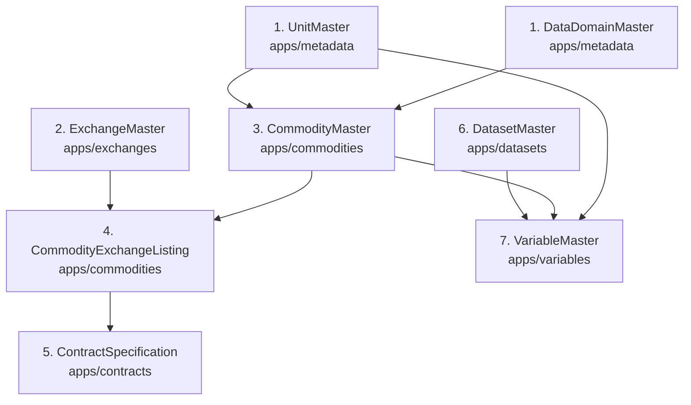

# Guide: Adding New Commodities and Exchanges

This guide provides a step-by-step reference for engineers and data managers on how to correctly input and register a new **Exchange Venue**, **Commodity**, and **Exchange Listing** into the system.

---

## 1. Architectural Dependency Order

Because the platform enforces strict relational integrity, point-in-time correctness, and deterministic unit conversions, records **must** be created in the correct hierarchical sequence.



### The 7-Step Dependency Chain:
1. **Unit of Measure (`UnitMaster`)**: Base physical unit (e.g. `METRIC_TON`, `BARREL`) and pricing unit (e.g. `USD_PER_MT`, `USD_PER_BBL`).
2. **Exchange Venue (`ExchangeMaster`)**: Execution venue, mic code, country, timezone, sessions, and holiday calendars.
3. **Physical Commodity (`CommodityMaster`)**: Physical asset taxonomy, chemistry specs, deliverable grade thresholds, delivery hub, and crop seasonality.
4. **Commodity Exchange Listing (`CommodityExchangeListing`)**: Multi-venue listing bridging the physical commodity to an exchange with ticker symbol, contract size, currency, and settlement rules.
5. **Contract Specification (`ContractSpecification`)**: Derivative futures rules, active month codes (F-Z), algorithmic expiry formulas, and roll conventions.
6. **Dataset (`DatasetMaster`)**: Data publication container, update cadence, and SLA.
7. **Variable (`VariableMaster`)**: Specific time series metric, stock vs. flow aggregation type, and transformation rules.

---

## 2. Step-by-Step Data Input Walkthrough

### Step 1: Verify / Add Units of Measure
Every commodity requires a `base_unit` (quantity) and `pricing_unit` (currency/quantity) from `UnitMaster`.

* **Admin Portal**: Navigate to **Metadata > Units of measure**.
* **ORM Check**:
```python
from apps.metadata.models import UnitMaster

# Verify if required units exist
barrel = UnitMaster.objects.get(code="BARREL")
usd_bbl = UnitMaster.objects.get(code="USD_PER_BBL")
```

---

### Step 2: Register Exchange Venue & Calendar
If the exchange is not already in the system, register the venue, operating timezone, and trading session.

* **Admin Portal**: Navigate to **Exchanges > Exchange masters > Add Exchange master**.
* **Key Fields**:
  - `mic_code`: ISO 10383 Market Identifier Code (e.g., `XINE`, `XNYM`, `XLME`).
  - `name`: Full venue title (e.g., `Shanghai International Energy Exchange`).
  - `country_code`: ISO 2-letter alpha (`CN`, `US`, `GB`).
  - `timezone`: IANA timezone name (`Asia/Shanghai`, `America/New_York`).
  - `is_regulated_futures_exchange`: `True` for designated contract markets.

* **ORM Example**:
```python
from apps.exchanges.models import ExchangeMaster

ine, _ = ExchangeMaster.objects.get_or_create(
    mic_code="XINE",
    defaults={
        "name": "Shanghai International Energy Exchange",
        "short_name": "INE",
        "country_code": "CN",
        "city": "Shanghai",
        "timezone": "Asia/Shanghai",
        "is_regulated_futures_exchange": True,
        "is_active": True,
    }
)
```

---

### Step 3: Register Canonical Physical Commodity
The `CommodityMaster` defines the physical asset independently of any single exchange.

* **Admin Portal**: Navigate to **Commodities > Commodity masters > Add Commodity master**.
* **Key Fields**:
  - `code`: Canonical institutional code (e.g. `CRUDE_OIL_MEDIUM_SOUR`).
  - `name`: Human-readable title (e.g. `Medium Sour Crude Oil`).
  - `sector`: Macro sector choice (`ENERGY`, `AGRICULTURE`, `BASE_METALS`, etc.).
  - `group`: Sub-industry category (`CRUDE_OIL`, `GRAINS`, `OILSEEDS`, etc.).
  - `primary_exchange`: Anchor venue (`ExchangeMaster`).
  - `base_unit`: Physical quantity (`BARREL`, `METRIC_TON`).
  - `pricing_unit`: Quotation unit (`USD_PER_BBL`, `CNY_PER_BBL`).
  - `lot_size`: Standard physical lot multiplier.
  - `settlement_method`: `PHYSICAL` (deliverable into tanks/warehouses) or `CASH`.
  - `quality_specifications`: JSON object with chemistry bounds (API gravity, sulfur, moisture).

* **ORM Example**:
```python
from apps.commodities.models import CommodityMaster, CommoditySector, CommodityGroup, SettlementMethod

commodity, _ = CommodityMaster.objects.get_or_create(
    code="CRUDE_OIL_MEDIUM_SOUR",
    defaults={
        "name": "Medium Sour Crude Oil",
        "sector": CommoditySector.ENERGY,
        "group": CommodityGroup.CRUDE_OIL,
        "primary_exchange": ine,
        "base_unit": barrel,
        "pricing_unit": cny_bbl,
        "lot_size": 1000.0,
        "settlement_method": SettlementMethod.PHYSICAL,
        "primary_delivery_hub": "Dalian, Ningbo, Zhoushan Bonded Storage Tanks",
        "quality_specifications": {
            "api_gravity_min": 32.0,
            "sulfur_max_pct": 1.5,
            "deliverable_crudes": ["Dubai", "Upper Zakum", "Oman", "Basrah Light", "Qatar Marine"]
        }
    }
)
```

---

### Step 4: Map Commodity Exchange Listing
A physical commodity may trade on multiple venues under different contract sizes and tickers. Create a `CommodityExchangeListing` for each venue.

* **Admin Portal**: Available as an inline form directly inside the `CommodityMaster` change page, or under **Commodities > Commodity exchange listings**.
* **Key Fields**:
  - `commodity`: Foreign key to `CommodityMaster`.
  - `exchange`: Foreign key to `ExchangeMaster`.
  - `ticker_symbol`: Execution symbol (e.g. `SC` on INE, `CL` on NYMEX).
  - `contract_size`: Volume per 1 contract (e.g. `1000.0` barrels).
  - `trading_currency`: ISO 4217 currency (`CNY`, `USD`, `EUR`).
  - `liquidity_tier`: Tier ranking (`TIER_1_GLOBAL_BENCHMARK`, `TIER_2_LIQUID_REGIONAL`, etc.).

* **ORM Example**:
```python
from apps.commodities.models import CommodityExchangeListing, LiquidityTier

listing, _ = CommodityExchangeListing.objects.get_or_create(
    commodity=commodity,
    exchange=ine,
    defaults={
        "ticker_symbol": "SC",
        "contract_size": 1000.0,
        "trading_currency": "CNY",
        "liquidity_tier": LiquidityTier.TIER_1_GLOBAL_BENCHMARK,
        "is_active": True,
    }
)
```

---

### Step 5: (Optional) Register Futures Contract Specification
If downstream analytics model the forward curve, register the derivatives specification:

* **Admin Portal**: Navigate to **Contracts > Contract specifications**.
* **Key Fields**:
  - `code`: `INE_SC_FUTURES`.
  - `active_month_codes`: Standard CME/ICE month letters (e.g. `FGHJKMNQUVXZ` for all 12 months).
  - `expiry_rule_type`: Algorithmic rule determining the last trading day.
  - `roll_convention`: Default rolling schedule (e.g. `5TH_TO_9TH_BUSINESS_DAY`).

---

## 3. Best Practices & Common Pitfalls

!!! warning "Do Not Create Commodities Without Base Units"
    Always ensure `base_unit` and `pricing_unit` are registered in `UnitMaster` first. Attempting to input strings that do not correspond to existing `UnitMaster` foreign keys will cause database constraint errors.

!!! tip "Use Seeders for Bulk Reference Data"
    When adding benchmark suites, implement the additions in the static catalog provider (`apps/commodities/providers/static_catalog.py`). This guarantees:
    - 100% offline development reproducibility.
    - Automated tests run against real market specifications.
    - Idempotency when running `python manage.py seed_commodities`.

---

## 4. Input Channels Summary

| Channel | Best For | Validation Feedback |
| :--- | :--- | :--- |
| **Django Admin UI** (`http://127.0.0.1:8000/admin/`) | Ad-hoc single entry, manual operational overrides | Instant HTML form validation with inline foreign key creation |
| **Static Catalog Provider** (`providers/static_catalog.py`) | Institutional benchmark suites, version-controlled additions | Checked by unit tests (`pytest`), seeded via `seed_<domain>` commands |
| **Django Shell / Migration Scripts** (`manage.py shell`) | Batch automated imports from CSV/JSON dumps | Full Python ORM error traceback and transaction rollback protection |
