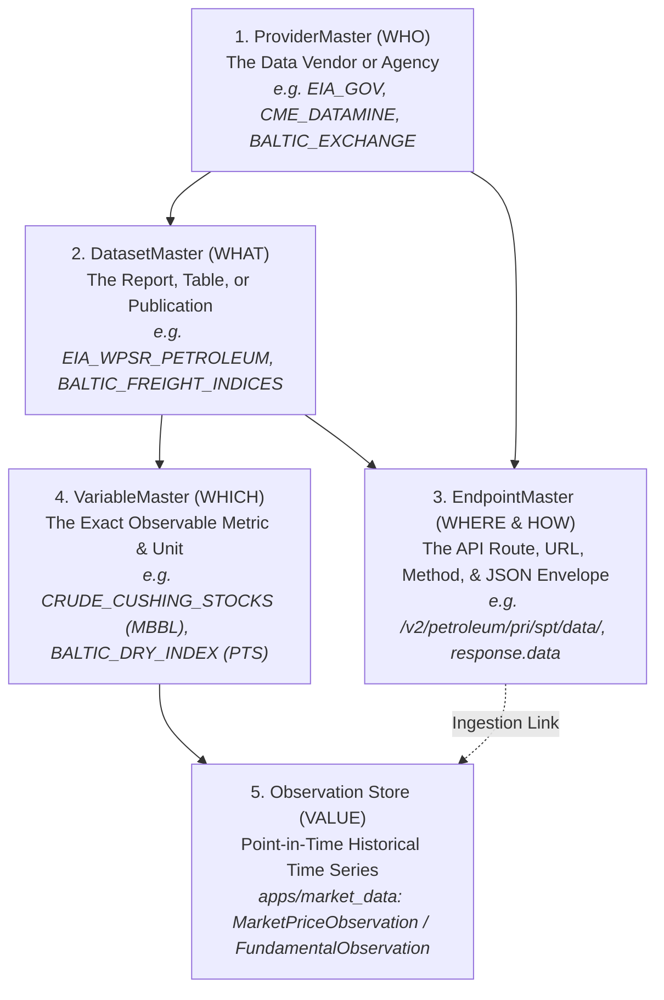

# Chapter 5: How to Add New Features, Datasets & Variables

When expanding the platform to support a new commodity metric, alternative data feed, or analytical feature (e.g. European Gas Storage, Baltic Dry Index, Tanker Freight Rates, or Weather Indices), this guide explains **exactly what needs to be updated and how to do it in under 2 minutes**.

---

## 1. The 4-Tier Metadata Hierarchy: Who \u2192 What \u2192 Where \u2192 Which

The platform maintains strict data lineage and provenance. Every observable quantitative metric is anchored by a 4-tier relational structure:



---

## 2. Do I Only Update `VariableMaster`, or Also `Datasets` and `Endpoints`?

The answer depends on **where the data comes from**:

### Scenario A: Adding a Metric from an *Existing* Dataset/Vendor
*Example: You want to add "US Strategic Petroleum Reserve (SPR) Crude Stocks", and the EIA Petroleum Report (`EIA_WPSR_PETROLEUM`) is already in the system.*
* **What to update**: **ONLY `VariableMaster`**!
* You simply create a new `VariableMaster` record (`CRUDE_US_SPR_STOCKS`) and point its `dataset` foreign key to the existing `EIA_WPSR_PETROLEUM` dataset.
* Zero changes needed to `ProviderMaster` or `EndpointMaster`.

### Scenario B: Adding a Metric from a *New* External Vendor or Report
*Example: You want to add the "Baltic Dry Index (BDI)" from the Baltic Exchange, or "European Gas Storage" from Gas Infrastructure Europe (GIE).*
* **What to update**: You register the full lineage so the system knows:
  1. **ProviderMaster**: Who provides the data (vendor name, base URL, auth type).
  2. **DatasetMaster**: What publication/report contains it (update cadence, category).
  3. **EndpointMaster**: Where to fetch it (URL path template, protocol, response format).
  4. **VariableMaster**: Which metric it is (code, unit, aggregation method, stock vs. flow).
* **Is there an easy way to update all of these at once?** **YES!** Use the declarative CLI tool below.

---

## 3. Method 1: The 10-Second Declarative CLI (`add_feature`)

To make adding new features effortless without writing manual database queries across 4 tables, the platform provides a built-in management command: `add_feature`.

### Command-Line Usage
Run the command directly in PowerShell or Bash:

```powershell
# Register the Baltic Dry Index (creates Provider, Dataset, Endpoint, and Variable in 1 atomic step)
.\.venv\Scripts\python.exe manage.py add_feature `
    --code=BALTIC_DRY_INDEX `
    --name="Baltic Dry Index" `
    --unit=INDEX_PTS `
    --domain=FREIGHT `
    --provider=BALTIC_EXCHANGE `
    --dataset=BALTIC_FREIGHT_INDICES `
    --endpoint-path="indices/bdi"
```

**Output**:
```text
  + Created ProviderMaster: 'BALTIC_EXCHANGE'
  + Created DatasetMaster: 'BALTIC_FREIGHT_INDICES'
  + Created EndpointMaster: 'BALTIC_FREIGHT_INDICES_FEED' (indices/bdi)
[SUCCESS] Created Feature Variable 'BALTIC_DRY_INDEX' -> Linked to Dataset 'BALTIC_FREIGHT_INDICES' & Provider 'BALTIC_EXCHANGE'.
```

### JSON File Usage (Batch Onboarding)
For bulk onboarding or CI/CD pipelines, define your feature in a simple JSON file:

```json
{
  "code": "EU_GAS_STORAGE_TWH",
  "name": "European Working Gas in Storage",
  "unit": "TWH",
  "domain": "INVENTORIES",
  "commodity": "NG",
  "dataset": "GIE_AGSI_STORAGE",
  "dataset_name": "Gas Infrastructure Europe AGSI+ Storage",
  "provider": "GIE_AGSI",
  "provider_name": "Gas Infrastructure Europe",
  "base_url": "https://agsi.gie.eu/api/v1/",
  "endpoint_path": "storage/eu/daily",
  "envelope_path": "data"
}
```

Run the loader:
```powershell
.\.venv\Scripts\python.exe manage.py add_feature --json-file=path/to/feature.json
```

---

## 4. Method 2: Visual Registration via Django Admin

If you prefer a web interface, you can register features via the Django Admin:

1. Open `http://127.0.0.1:8000/admin/` in your browser.
2. Under **Variables**, click **Add Variable Master**.
3. Fill in:
   - **Code**: `EU_GAS_STORAGE_TWH`
   - **Name**: `European Working Gas in Storage`
   - **Dataset**: Select existing dataset or click the green `+` icon to add a new Dataset & Provider inline.
   - **Unit**: Select canonical Unit of Measure (e.g. `TWH`, `BCF`, `MBBL`).
   - **Aggregation Method**: `LAST` (for stock/inventory snapshot) or `SUM` (for flow/production).
4. Click **Save**.

---

## 5. Method 3: Version-Controlled Catalog Provider

If you want the new feature committed permanently to the repository so every environment automatically seeds it on deployment:

1. Open [`apps/variables/providers/static_catalog.py`](file:///c:/Users/Shilpa/OneDrive/Documents/commodity-market-smart-analyst/apps/variables/providers/static_catalog.py).
2. Append your new `RawVariableSpec`:

```python
RawVariableSpec(
    code="EU_GAS_STORAGE_TWH",
    name="European Working Gas in Storage",
    description="Aggregate working natural gas storage level in EU member states.",
    dataset_code="GIE_AGSI_STORAGE",
    domain_code="INVENTORIES",
    commodity_code="NG",
    unit_code="TWH",
    data_type="DECIMAL",
    aggregation_method="LAST",
    seasonal_adjustment="UNADJUSTED",
    display_transformation="RAW_LEVEL",
    is_benchmark=True,
    is_active=True,
)
```

3. Run `python manage.py seed_variables` to apply the changes idempotently.

---

## 6. How the Downstream Quant Engine & LLM Pick It Up Automatically

Once a feature is registered in `VariableMaster`:
1. **Observation Ingestion**: Ingest time series into `apps/market_data` (`FundamentalObservation` records referencing your variable).
2. **Quant Analytics**: The Quant Engine queries observations by variable code to compute 5-year seasonality envelopes, z-scores, and percentage deviations automatically.
3. **LLM Context Builder**: The Evidence Context Builder (`apps/narratives`) automatically pulls the latest value, 1-week change, and seasonal percentile of benchmark variables into the prompt context for LLM briefing synthesis.
4. **Zero Code Refactoring**: Neither the Quant Engine nor the LLM narrative builder requires any hardcoded code changes to analyze the new feature!
