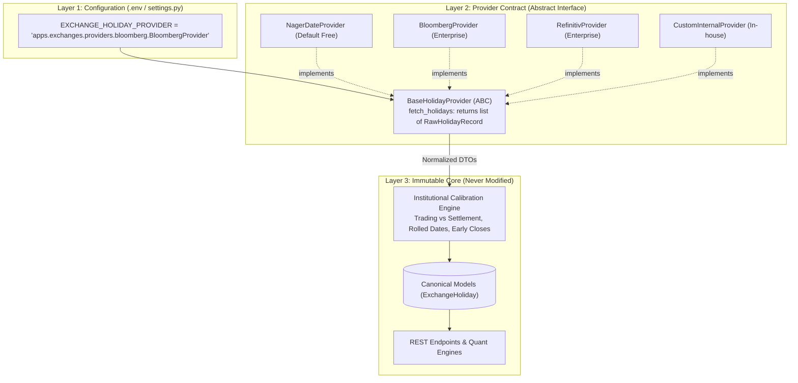

# Zero-Friction Data Provider Architecture & Integration Guide

The **Commodity Market Intelligence Platform** is built on an architectural guarantee: **changing an external data vendor must require zero changes to core business logic, database models, REST APIs, or downstream quantitative analytics.**

---

## 1. The Core Architecture: The Pluggable Provider Pattern

In typical financial software, external API logic is often coupled directly with database models and views. If a vendor changes their API schema, deprecates an endpoint, or raises their prices, the entire application breaks.

In our system, every external data source sits behind a **3-Layer Pluggable Boundary**:



---

## 2. The 3 Steps to Swap Any Data Provider

When someone wants to replace a default data source with a new provider (e.g. Bloomberg, Refinitiv, CME Datamine, or internal proprietary feeds), they only need to perform **3 simple steps**:

### Step 1: Create a Provider Class
Create a new file in the app's `providers/` folder implementing the standard base contract:

```python
# apps/exchanges/providers/bloomberg.py
from datetime import datetime
import httpx
from apps.exchanges.providers.base import BaseHolidayProvider, RawHolidayRecord

class BloombergHolidayProvider(BaseHolidayProvider):
    """Fetches exchange calendar closures from Bloomberg B-PIPE / Web API."""
    
    def fetch_holidays(self, exchange, year: int) -> list[RawHolidayRecord]:
        endpoint = f"https://api.bloomberg.com/eikon/v1/calendars/{exchange.mic}/{year}"
        headers = {"Authorization": "Bearer YOUR_API_KEY"}
        
        with httpx.Client(timeout=10.0) as client:
            resp = client.get(endpoint, headers=headers)
            resp.raise_for_status()
            data = resp.json()
            
        records = []
        for item in data.get("holidays", []):
            records.append(
                RawHolidayRecord(
                    date=datetime.strptime(item["date"], "%Y-%m-%d").date(),
                    name=item["holiday_name"],
                    country_code=exchange.country,
                )
            )
        return records
```

### Step 2: Update Configuration
Point to your new provider class in `.env` or `config/settings/base.py`:

```bash
# In .env:
EXCHANGE_HOLIDAY_PROVIDER="apps.exchanges.providers.bloomberg.BloombergHolidayProvider"
```

### Step 3: Run the Sync Command
```powershell
python manage.py sync_exchange_holidays --exchange NYMEX --year 2026
```

**That's it!**
- :white_check_mark: **Zero changes** to Django models (`ExchangeMaster`, `ExchangeHoliday`).
- :white_check_mark: **Zero changes** to REST API views or serializers.
- :white_check_mark: **Zero changes** to downstream quantitative curves, charts, or alerts.
- :white_check_mark: The calibration engine automatically applies trading vs. settlement rules, Black Friday early settlement, and MCX split sessions to the raw dates.

---

## 3. The Base Provider Contract Specification

Every data provider interface in the platform enforces strict typing using Python's `abc.ABC` and dataclasses.

### The Input Requirements
A provider function receives only canonical entity objects or standardized scalars:
- `exchange`: The `ExchangeMaster` instance (provides `exchange.code`, `exchange.mic`, `exchange.country`, `exchange.timezone`).
- `year`: The 4-digit integer year (e.g. `2026`).

### The Output Requirements (Data Transfer Object)
The provider must return a list of typed `RawHolidayRecord` objects:

```python
from dataclasses import dataclass
from datetime import date as dt_date

@dataclass(frozen=True)
class RawHolidayRecord:
    date: dt_date
    name: str
    country_code: str
    source_api: str = "EXTERNAL_PROVIDER"
```

### Error Handling & Fallback Guarantees
1. **No System Crashes**: If an external provider throws an HTTP error, socket timeout, or 401 Unauthorized, the provider wrapper catches the exception and logs a structured warning.
2. **Automatic Circuit Breaker**: When an external provider fails, the system automatically activates the **Deterministic Fallback Engine** (`DEFAULT_CORE_HOLIDAYS`), ensuring zero downtime in production and 100% offline capability in testing environments.

---

## 4. Case Study 2: Swapping Commodity Specifications Provider (`apps/commodities`)

The same pluggable provider contract governs physical commodity definitions and multi-venue exchange listings.

### Step 1: Implement `BaseCommodityCatalogProvider`
Create your adapter class inheriting from `BaseCommodityCatalogProvider` in `apps/commodities/providers/` (e.g. `cme_provider.py`):

```python
from decimal import Decimal
from typing import List, Optional
from apps.commodities.providers.base import (
    BaseCommodityCatalogProvider,
    RawCommoditySpec,
    RawExchangeListingSpec,
)

class CMEDatamineCatalogProvider(BaseCommodityCatalogProvider):
    """Fetches commodity definitions and exchange listings from CME Datamine API."""

    def __init__(self, api_key: str = ""):
        self.api_key = api_key

    def get_commodities(self) -> List[RawCommoditySpec]:
        # 1. Fetch raw JSON payload from external API
        # 2. Normalize into canonical RawCommoditySpec and RawExchangeListingSpec DTOs
        # 3. Return clean list with zero vendor dictionary leakage
        return [
            RawCommoditySpec(
                code="CL",
                name="Light Sweet Crude Oil (WTI)",
                sector="ENERGY",
                group="CRUDE_OIL",
                primary_exchange_code="NYMEX",
                base_unit_code="BBL",
                pricing_unit_code="USD_BBL",
                standard_lot_size=Decimal("1000.0"),
                standard_lot_unit_code="BBL",
                minimum_tick_size=Decimal("0.01"),
                tick_value=Decimal("10.00"),
                tick_currency="USD",
                settlement_method="PHYSICAL",
                deliverable_grade_standard="Light Sweet Crude (API 37°-42°, Sulfur <= 0.42%)",
                primary_delivery_hub="Cushing, Oklahoma",
                listings=[
                    RawExchangeListingSpec(
                        exchange_code="NYMEX",
                        ticker_symbol="CL",
                        contract_size=Decimal("1000.0"),
                        contract_unit_code="BBL",
                        settlement_method="PHYSICAL",
                        is_primary_benchmark=True,
                        typical_daily_volume=950000,
                    ),
                    RawExchangeListingSpec(
                        exchange_code="MCX",
                        ticker_symbol="CRUDEOIL",
                        contract_size=Decimal("100.0"),
                        contract_unit_code="BBL",
                        settlement_method="CASH",
                        trading_currency="INR",
                        typical_daily_volume=85000,
                    ),
                ],
            )
        ]

    def get_commodity(self, code: str) -> Optional[RawCommoditySpec]:
        for c in self.get_commodities():
            if c.code.upper() == code.upper():
                return c
        return None
```

### Step 2: Register in `providers/factory.py` & `.env`
Update `apps/commodities/providers/factory.py`:
```python
elif provider_type == "cme_datamine":
    from .cme_provider import CMEDatamineCatalogProvider
    return CMEDatamineCatalogProvider(api_key=settings.CME_DATAMINE_API_KEY)
```

In `.env`:
```bash
COMMODITY_CATALOG_PROVIDER="cme_datamine"
CME_DATAMINE_API_KEY="your-api-key"
```

### Step 3: Run the Seeder
```powershell
python manage.py seed_commodities
```
The database models, REST endpoints, and UI dashboard update automatically with zero code changes.

---

## 5. Case Study 3: Swapping Contract Specifications & Derivative Reference Provider (`apps/contracts`)

Derivative contract specifications and delivery cycle schedules are managed via `BaseContractSpecProvider` in `apps/contracts/providers/base.py`.

### Step 1: Implement `BaseContractSpecProvider`
Create your adapter class in `apps/contracts/providers/` (e.g. `cme_datamine_contracts.py`):

```python
from decimal import Decimal
from typing import List, Optional
from apps.contracts.providers.base import BaseContractSpecProvider, RawContractSpec

class CMEDatamineContractProvider(BaseContractSpecProvider):
    """Fetches futures contract specifications from CME Datamine Reference API."""

    def __init__(self, api_key: str = ""):
        self.api_key = api_key

    def get_specifications(self) -> List[RawContractSpec]:
        # 1. Fetch specifications from remote endpoint
        # 2. Normalize into strongly typed RawContractSpec DTOs
        return [
            RawContractSpec(
                commodity_code="CL",
                exchange_mic="XNYM",
                symbol_root="CL",
                name="Light Sweet Crude Oil (WTI) Futures",
                contract_size=Decimal("1000.0"),
                contract_unit_code="BBL",
                price_quote_unit_code="USD_BBL",
                minimum_tick_size=Decimal("0.01"),
                tick_value=Decimal("10.00"),
                trading_currency="USD",
                instrument_type="FUTURES",
                settlement_method="PHYSICAL",
                trading_months="ALL_12",
                expiry_rule="DAY_OF_PRIOR_MONTH_WITH_BUS_OFFSET",
                expiry_rule_parameter=25,
                prompt_cycles_to_seed=12,
            ),
        ]

    def get_specification(self, symbol_root: str, exchange_mic: str) -> Optional[RawContractSpec]:
        for s in self.get_specifications():
            if s.symbol_root.upper() == symbol_root.upper() and s.exchange_mic.upper() == exchange_mic.upper():
                return s
        return None
```

### Step 2: Register in `providers/factory.py` & `.env`
Update `apps/contracts/providers/factory.py` or specify the dotted path in `.env`:
```bash
CONTRACT_SPEC_PROVIDER="apps.contracts.providers.cme_datamine_contracts.CMEDatamineContractProvider"
CME_DATAMINE_API_KEY="your-cme-api-key"
```

### Step 3: Run the Contract Seeder
```powershell
python manage.py seed_contracts
```
The command automatically instantiates the provider, normalizes contract specs, and runs the `ContractExpiryService` algorithm to calculate exact prompt delivery schedules without code modifications.

---

## 6. Case Study 4: Swapping the Dataset Master Catalog Provider

In **Phase 6: Dataset Master**, the catalog of observable dataset definitions across categories (prices, inventories, balance sheets, weather, positioning) is governed by `BaseDatasetCatalogProvider`.

Suppose an enterprise data governance team maintains their central dataset registry in **AWS Glue Data Catalog**, **Snowflake Data Marketplace**, or an internal metadata microservice.

### Step 1: Implement `BaseDatasetCatalogProvider`
Create `apps/datasets/providers/aws_glue_catalog.py`:

```python
from typing import List, Optional
from apps.datasets.providers.base import BaseDatasetCatalogProvider, RawDatasetSpec

class AWSGlueDatasetCatalogProvider(BaseDatasetCatalogProvider):
    """Synchronizes dataset catalog specifications from AWS Glue Data Catalog."""

    def get_datasets(self) -> List[RawDatasetSpec]:
        # Connect to AWS Glue / Boto3 client
        # Fetch metadata tables and transform to RawDatasetSpec DTOs
        return [
            RawDatasetSpec(
                code="EIA_WPSR_PETROLEUM",
                name="EIA Weekly Petroleum Status Report",
                description="Weekly US crude oil inventories and refinery runs.",
                domain_code="ENERGY",
                frequency_code="WEEKLY",
                source_authority="US Energy Information Administration (EIA)",
                data_category="INVENTORIES_STOCKS",
                update_cadence="WEEKLY_FIXED_DAY",
                ingestion_mode="PULL_SCHEDULED_BATCH",
                sla_max_delay_minutes=15,
                primary_commodity_code="CL",
                commodity_codes=["CL", "BRENT"],
            ),
        ]

    def get_dataset(self, code: str) -> Optional[RawDatasetSpec]:
        for spec in self.get_datasets():
            if spec.code.upper() == code.upper():
                return spec
        return None
```

### Step 2: Configure Environment Variable
In `.env` or Django settings:
```bash
DATASET_CATALOG_PROVIDER="apps.datasets.providers.aws_glue_catalog.AWSGlueDatasetCatalogProvider"
```

### Step 3: Run the Dataset Catalog Seeder
```powershell
python manage.py seed_datasets
```
The seeder resolves domain taxonomy foreign keys, links multiple commodities via ManyToMany, validates update cadences, and maintains strict idempotency.

---

## 7. Case Study 5: Swapping the Variable Master Catalog Provider

In **Phase 7: Variable Master**, the dictionary of canonical time-series variables and metric definitions is governed by `BaseVariableCatalogProvider`.

Suppose an institutional quantitative research team stores their quantitative feature definitions in an enterprise **Feature Store** (e.g., **Feast**, **Databricks Feature Store**, or internal PostgreSQL database).

### Step 1: Implement `BaseVariableCatalogProvider`
Create `apps/variables/providers/enterprise_feature_store.py`:

```python
from typing import List, Optional
from apps.variables.providers.base import BaseVariableCatalogProvider, RawVariableSpec

class EnterpriseFeatureStoreVariableProvider(BaseVariableCatalogProvider):
    """Synchronizes standardized metrics from an internal quantitative feature store."""

    def get_variables(self) -> List[RawVariableSpec]:
        # Connect to internal feature store or database
        return [
            RawVariableSpec(
                code="CRUDE_CUSHING_STOCKS",
                name="Cushing Oklahoma Ending Crude Oil Stocks",
                description="Weekly ending stocks of crude oil at Cushing, Oklahoma.",
                dataset_code="EIA_WPSR_PETROLEUM_STOCKS",
                domain_code="INVENTORIES",
                unit_code="MBBL",
                commodity_code="CL",
                data_type="DECIMAL",
                aggregation_method="LAST",
                default_transformation="DIFF_1W",
                is_benchmark=True,
                display_order=10,
            ),
        ]

    def get_variable(self, code: str) -> Optional[RawVariableSpec]:
        for spec in self.get_variables():
            if spec.code.upper() == code.upper():
                return spec
        return None
```

### Step 2: Configure Environment Variable
In `.env` or Django settings:
```bash
VARIABLE_CATALOG_PROVIDER="apps.variables.providers.enterprise_feature_store.EnterpriseFeatureStoreVariableProvider"
```

### Step 3: Run the Variable Seeder
```powershell
python manage.py seed_variables
```
The seeder resolves foreign keys to `DatasetMaster`, `DataDomainMaster`, `UnitMaster`, and `CommodityMaster`, ensuring deterministic stock vs. flow aggregation rules without modifying application code.

---

## 8. Case Study 6: Swapping the Provider Master Catalog Provider

In **Phase 8: Provider Master**, external vendors, government statistical agencies, exchange feeds, and rate limit policies are governed by `BaseProviderCatalogProvider`.

Suppose an enterprise organization manages their vendor directories and API access credentials in an enterprise **Configuration Management Database (CMDB)** or **Internal API Gateway Registry** (e.g. Kong, Apigee, AWS Systems Manager Parameter Store).

### Step 1: Implement `BaseProviderCatalogProvider`
Create `apps/providers/providers/enterprise_cmdb.py`:

```python
from typing import List, Optional
from apps.providers.providers.base import BaseProviderCatalogProvider, RawProviderSpec

class EnterpriseCMDBProviderCatalog(BaseProviderCatalogProvider):
    """Synchronizes external vendor metadata from an internal enterprise CMDB service."""

    def get_providers(self) -> List[RawProviderSpec]:
        # Connect to internal API gateway or CMDB
        return [
            RawProviderSpec(
                code="EIA_GOV",
                name="U.S. Energy Information Administration",
                description="Official energy statistics.",
                provider_type="GOVERNMENT_PUBLIC",
                base_url="https://api.eia.gov/v2/",
                auth_type="API_KEY_QUERY_PARAM",
                env_var_name="EIA_API_KEY",
                auth_param_name="api_key",
                rate_limit_requests=5000,
                rate_limit_window_seconds=3600,
                target_sla_pct=99.80,
                display_order=10,
            ),
        ]

    def get_provider(self, code: str) -> Optional[RawProviderSpec]:
        for spec in self.get_providers():
            if spec.code.upper() == code.upper():
                return spec
        return None
```

### Step 2: Configure Environment Variable
In `.env` or Django settings:
```bash
PROVIDER_CATALOG_PROVIDER="apps.providers.providers.enterprise_cmdb.EnterpriseCMDBProviderCatalog"
```

### Step 3: Run the Provider Seeder
```powershell
python manage.py seed_providers
```
The seeder loads all vendor definitions, maps environment variable keys, sets rate budgets, and establishes fallback chains idempotently.

---

## 9. Universal Provider Registry Across All System Modules

We apply this exact pluggable architecture across every data domain in the platform:

| Data Domain | Module | Active Default Provider | Target Interface Contract | Future Institutional Providers |
| :--- | :--- | :--- | :--- | :--- |
| **Exchange Holidays** | `apps/exchanges` | Nager.Date API | `BaseHolidayProvider` | Bloomberg SIFMA, Refinitiv, CME Direct |
| **Commodity Specifications** | `apps/commodities` | Static Reference Master | `BaseCommodityCatalogProvider` | Exchange Product Directories |
| **Futures Reference Specs** | `apps/contracts` | Static Canonical Catalog | `BaseContractSpecProvider` | CME Datamine, ICE Reference Data |
| **Dataset Master Catalog** | `apps/datasets` | Static Benchmark Catalog | `BaseDatasetCatalogProvider` | AWS Glue, Snowflake Marketplace, Collibra |
| **Variable Master Catalog** | `apps/variables` | Static Benchmark Catalog | `BaseVariableCatalogProvider` | Feast, Databricks Feature Store, Hopsworks |
| **Provider Master Catalog** | `apps/providers` | Static Benchmark Catalog | `BaseProviderCatalogProvider` | HashiCorp Vault, AWS SSM, Kong Gateway |
| **Market Data (OHLCV)** | `apps/market_data` | Public / Open Market Feed | `BaseMarketDataProvider` | B-PIPE, Refinitiv Real-Time, Polygon |
| **CFTC COT Positioning** | `apps/positioning` | CFTC Socrata API | `BaseCOTProvider` | CFTC Bulk FTP, Bloomberg COT |
| **Weather & Climate** | `apps/weather` | NOAA / Open-Meteo | `BaseWeatherProvider` | ECMWF, Copernicus, Maxar Weather |
| **Physical Inventories** | `apps/fundamentals` | EIA API v2 / USDA FAS | `BaseInventoryProvider` | Kpler, Vortexa, Kayrros Satellite |

---

## 9. Developer Checklist for Adding Any New Data Provider

Before committing a new provider adapter to the codebase, verify:

- [ ] **Contract Compliance**: Does your class inherit from the domain's `BaseProvider`?
- [ ] **Deterministic Output**: Does it return normalized DTOs (`RawHolidayRecord`, `RawContractSpec`, `RawPriceBar`, etc.) rather than raw vendor JSON?
- [ ] **Timezone Normalization**: Are all timestamps converted to UTC before returning?
- [ ] **Graceful Exception Handling**: Does it catch `httpx.RequestError` or timeout exceptions and avoid crashing the main thread?
- [ ] **Config Switchable**: Can the system switch back and forth between providers by simply altering `.env`?
- [ ] **Unit Tests**: Have you added mock tests verifying the parser against sample vendor JSON payloads?

