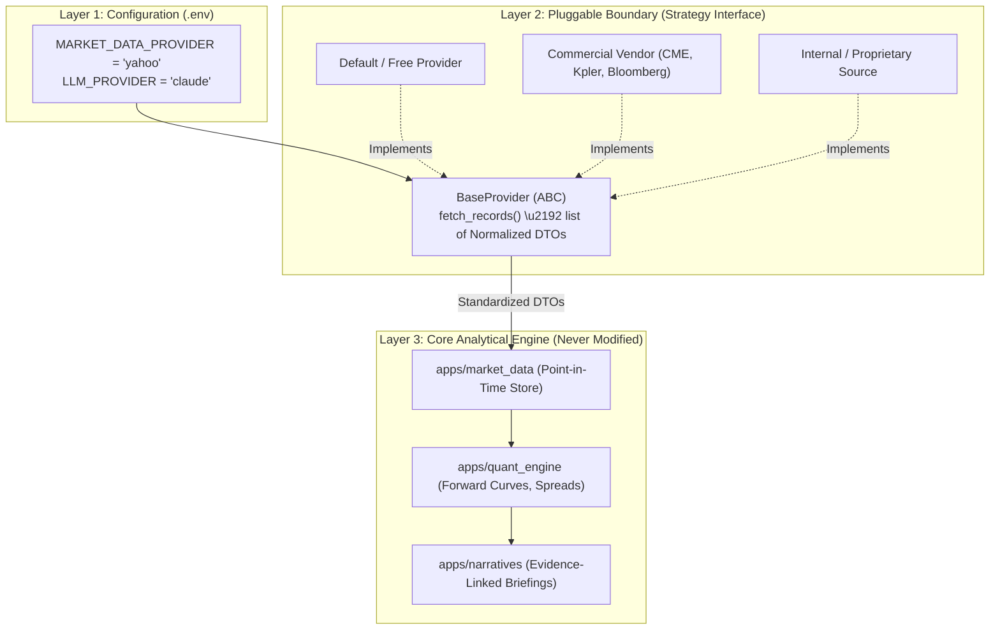

# Complete Data Provider & LLM Swapping Guide

The **Commodity Market Intelligence Platform** is built on an absolute architectural guarantee: **replacing an external data vendor, news feed, or LLM reasoning model requires ZERO changes to core database models, REST APIs, or downstream quantitative analytics.**

This guide gives the exact, step-by-step instructions and complete code implementations for swapping every data source in the system.

---

## 1. The Pluggable Provider Architecture

In typical financial software, external API logic is tightly coupled with database models and views. If a vendor changes their API schema, deprecates an endpoint, or raises their prices, the entire application breaks.

In our system, every external feed is isolated behind a **3-Layer Strategy + Factory Boundary**:



---

## 2. Developer Quick-Reference: What & Where to Change

| Target Component | How to Swap It | Files Touched |
| :--- | :--- | :--- |
| **Market Price Feed**<br>*(e.g., Yahoo, CME Datamine, Polygon)* | Implement `BaseMarketDataProvider` in `apps/market_data/providers/` and set `MARKET_DATA_PROVIDER=cme_datamine` in `.env`. | **1 adapter file**; zero database or quant logic changes. |
| **Fundamental Inventory Source**<br>*(e.g., EIA API v2, Kpler, Vortexa, USDA)* | Implement `BaseFundamentalProvider` in `apps/market_data/providers/` and set `FUNDAMENTAL_DATA_PROVIDER=kpler` in `.env`. | **1 adapter file**; observations map automatically to canonical variables. |
| **News & Sentiment Source**<br>*(e.g., RSS, Bloomberg News, NewsAPI)* | Implement `BaseNewsProvider` in `apps/news_intel/providers/` and set `NEWS_PROVIDER=bloomberg` in `.env`. | **1 adapter file**; articles auto-tag to physical commodities. |
| **LLM Reasoning Engine**<br>*(e.g., Gemini, Claude, OpenAI GPT-4o, Local Ollama)* | Implement `BaseLLMProvider` in `apps/narratives/providers/` and set `LLM_PROVIDER=claude` in `.env`. | **1 adapter file**; prompt templates and context builders remain unchanged. |
| **Add a Brand-New Feature**<br>*(e.g., Baltic Dry Index, Tanker Freight, EU Gas)* | Run `python manage.py add_feature` to register the feature in 10 seconds. | **Zero code changes**; Quant engine & LLM pick it up automatically. |

---

## 3. How to Swap Market Data Providers (Step-by-Step)

Suppose you want to replace the default static benchmark provider with a live market pricing feed like **Yahoo Finance** or **CME Datamine**.

### Step 3.1: Create the Provider Class
Create a new file `apps/market_data/providers/yahoo_provider.py` inheriting from [`BaseMarketDataProvider`](file:///c:/Users/Shilpa/OneDrive/Documents/commodity-market-smart-analyst/apps/market_data/providers/base.py):

```python
# apps/market_data/providers/yahoo_provider.py
from datetime import date, datetime, timezone
from decimal import Decimal
import yfinance as yf
from .base import BaseMarketDataProvider, RawPriceObservation

class YahooMarketDataProvider(BaseMarketDataProvider):
    """Fetches daily commodity futures price bars from Yahoo Finance."""

    TICKER_MAP = {
        "CL": "CL=F",      # WTI Crude Oil
        "BRENT": "BZ=F",   # Brent Crude Oil
        "NG": "NG=F",      # Natural Gas
        "GOLD": "GC=F",    # Gold
        "CORN": "ZC=F",    # Corn
    }

    @property
    def name(self) -> str:
        return "Yahoo Finance Commodity Feed"

    def fetch_price_observations(
        self,
        symbol: str,
        start_date: date | None = None,
        end_date: date | None = None,
        **kwargs,
    ) -> list[RawPriceObservation]:
        ticker_str = self.TICKER_MAP.get(symbol.upper(), f"{symbol}=F")
        df = yf.download(ticker_str, start=start_date, end=end_date, progress=False)

        observations = []
        for index, row in df.iterrows():
            obs_date = index.date()
            observations.append(
                RawPriceObservation(
                    symbol=symbol.upper(),
                    observation_date=obs_date,
                    contract_month="PROMPT",
                    is_prompt=True,
                    open_price=Decimal(str(round(row["Open"], 4))),
                    high_price=Decimal(str(round(row["High"], 4))),
                    low_price=Decimal(str(round(row["Low"], 4))),
                    close_price=Decimal(str(round(row["Close"], 4))),
                    settlement_price=Decimal(str(round(row["Close"], 4))),
                    volume=int(row["Volume"]) if not row["Volume"].isna() else None,
                    open_interest=None,
                    publication_time=datetime.combine(obs_date, datetime.min.time(), tzinfo=timezone.utc),
                    source_endpoint_code="YAHOO_FINANCE_API",
                )
            )
        return observations
```

### Step 3.2: Register with the Factory
In [`apps/market_data/providers/factory.py`](file:///c:/Users/Shilpa/OneDrive/Documents/commodity-market-smart-analyst/apps/market_data/providers/factory.py), register your new provider:

```python
from .yahoo_provider import YahooMarketDataProvider

_MARKET_DATA_PROVIDERS["yahoo"] = YahooMarketDataProvider
```

### Step 3.3: Set in `.env`
Update your `.env` configuration file:
```bash
MARKET_DATA_PROVIDER=yahoo
```

### Step 3.4: Test and Ingest
Run the ingestion command to test your new feed:
```powershell
.\.venv\Scripts\python.exe manage.py ingest_market_data --type=prices --commodity=CL --days=30
```

---

## 4. How to Swap Fundamental Data Providers (Step-by-Step)

Suppose you want to switch from the static inventory simulator to the official **U.S. EIA API v2** or a private vessel intelligence vendor like **Kpler**.

### Step 4.1: Create the Provider Class
Create `apps/market_data/providers/eia_api_provider.py` inheriting from [`BaseFundamentalProvider`](file:///c:/Users/Shilpa/OneDrive/Documents/commodity-market-smart-analyst/apps/market_data/providers/base.py):

```python
# apps/market_data/providers/eia_api_provider.py
from datetime import date, datetime, timezone
from decimal import Decimal
import httpx
from django.conf import settings
from .base import BaseFundamentalProvider, RawFundamentalObservation

class EIAApiFundamentalProvider(BaseFundamentalProvider):
    """Fetches official weekly petroleum and natural gas fundamentals from EIA API v2."""

    SERIES_ROUTES = {
        "CRUDE_CUSHING_STOCKS": "petroleum/stoc/wstk/data/?data[]=value&facets[series][]=WCSSTUS1",
        "CRUDE_US_TOTAL_COMMERCIAL_STOCKS": "petroleum/stoc/wstk/data/?data[]=value&facets[series][]=WCESTUS1",
        "NATGAS_LOWER_48_WORKING_STORAGE": "natural-gas/stor/wkly/data/?data[]=value&facets[series][]=NW2_EPG0_SWO_R48_BCF",
    }

    @property
    def name(self) -> str:
        return "U.S. Energy Information Administration (EIA v2 API)"

    def fetch_fundamental_observations(
        self,
        variable_code: str,
        start_date: date | None = None,
        end_date: date | None = None,
        **kwargs,
    ) -> list[RawFundamentalObservation]:
        route = self.SERIES_ROUTES.get(variable_code)
        if not route:
            return []

        api_key = getattr(settings, "EIA_API_KEY", "")
        url = f"https://api.eia.gov/v2/{route}&api_key={api_key}"

        with httpx.Client(timeout=15.0) as client:
            resp = client.get(url)
            resp.raise_for_status()
            data = resp.json()["response"]["data"]

        observations = []
        for row in data:
            obs_date = datetime.strptime(row["period"], "%Y-%m-%d").date()
            if start_date and obs_date < start_date:
                continue
            if end_date and obs_date > end_date:
                continue

            observations.append(
                RawFundamentalObservation(
                    variable_code=variable_code,
                    observation_date=obs_date,
                    value=Decimal(str(row["value"])) if row["value"] is not None else None,
                    unit_code="MBBL" if "petroleum" in route else "BCF",
                    period_end=obs_date,
                    publication_time=datetime.now(timezone.utc),
                    source_endpoint_code="EIA_V2_PETROLEUM",
                )
            )
        return observations
```

### Step 4.2: Register with the Factory
In [`apps/market_data/providers/factory.py`](file:///c:/Users/Shilpa/OneDrive/Documents/commodity-market-smart-analyst/apps/market_data/providers/factory.py):
```python
from .eia_api_provider import EIAApiFundamentalProvider

_FUNDAMENTAL_PROVIDERS["eia_api"] = EIAApiFundamentalProvider
```

### Step 4.3: Set in `.env`
```bash
FUNDAMENTAL_DATA_PROVIDER=eia_api
EIA_API_KEY=your_eia_api_key_here
```

### Step 4.4: Ingest and Verify
```powershell
.\.venv\Scripts\python.exe manage.py ingest_market_data --type=fundamentals --days=60
```

---

## 5. How to Swap News and Sentiment Providers (Step-by-Step)

Suppose you want to switch news ingestion from static headlines to **NewsAPI**, **Bloomberg Terminal RSS**, or **AlphaVantage News**.

### Step 5.1: Create the Provider Class
```python
# apps/news_intel/providers/newsapi_provider.py
from datetime import datetime
import httpx
from .base import BaseNewsProvider, RawNewsArticle

class NewsApiProvider(BaseNewsProvider):
    """Fetches real-time commodity news articles via NewsAPI."""

    @property
    def name(self) -> str:
        return "NewsAPI Commercial Feed"

    def fetch_articles(self, query: str, api_key: str) -> list[RawNewsArticle]:
        url = f"https://newsapi.org/v2/everything?q={query}&apiKey={api_key}&language=en&sortBy=publishedAt"
        with httpx.Client(timeout=10.0) as client:
            resp = client.get(url)
            articles = resp.json().get("articles", [])

        records = []
        for item in articles:
            records.append(
                RawNewsArticle(
                    headline=item["title"],
                    summary=item.get("description", ""),
                    source_name=item["source"]["name"],
                    published_at=datetime.fromisoformat(item["publishedAt"].replace("Z", "+00:00")),
                    url=item["url"],
                )
            )
        return records
```

### Step 5.2: Set in `.env`
```bash
NEWS_PROVIDER=newsapi
NEWSAPI_KEY=your_key_here
```

---

## 6. How to Swap LLM Models and Providers (Step-by-Step)

The Evidence-Based Narrative engine (`apps/narratives`) does not allow LLMs to perform arithmetic or access untrusted data. It provides the LLM with verified quantitative features (e.g. forward curve slopes, inventory deviations, COT positioning) and asks for institutional synthesis.

You can swap between **Google Gemini**, **Anthropic Claude**, **OpenAI GPT-4o**, or a **local Ollama instance** by setting 1 variable:

### Step 6.1: Provider Implementations
```python
# apps/narratives/providers/claude_provider.py
import anthropic
from .base import BaseLLMProvider

class AnthropicClaudeProvider(BaseLLMProvider):
    """Generates market narrative briefings using Anthropic Claude 3.5 Sonnet."""

    def __init__(self, api_key: str, model: str = "claude-3-5-sonnet-20241022"):
        self.client = anthropic.Anthropic(api_key=api_key)
        self.model = model

    def generate_briefing(self, prompt: str, system_context: str) -> str:
        message = self.client.messages.create(
            model=self.model,
            max_tokens=1500,
            temperature=0.2, # Low temperature for quantitative accuracy
            system=system_context,
            messages=[{"role": "user", "content": prompt}]
        )
        return message.content[0].text
```

For **local offline inference with Ollama**:
```python
# apps/narratives/providers/ollama_provider.py
import httpx
from .base import BaseLLMProvider

class LocalOllamaProvider(BaseLLMProvider):
    """Runs local inference using Llama 3 / Mistral via local Ollama daemon."""

    def __init__(self, host: str = "http://localhost:11434", model: str = "llama3"):
        self.host = host
        self.model = model

    def generate_briefing(self, prompt: str, system_context: str) -> str:
        with httpx.Client(timeout=60.0) as client:
            resp = client.post(
                f"{self.host}/api/generate",
                json={"model": self.model, "prompt": f"{system_context}\n\n{prompt}", "stream": False}
            )
            return resp.json()["response"]
```

### Step 6.2: Switch in `.env`
To switch providers, update `.env`:
```bash
# To use Anthropic Claude:
LLM_PROVIDER=claude
ANTHROPIC_API_KEY=sk-ant-...

# OR to use local offline Ollama:
LLM_PROVIDER=ollama
OLLAMA_HOST=http://localhost:11434
OLLAMA_MODEL=llama3:8b

# OR to use Google Gemini:
LLM_PROVIDER=gemini
GEMINI_API_KEY=AIzaSy...
```

---

## 7. How to Swap Exchange Calendar Providers (Step-by-Step)

To switch exchange holiday calendar feeds from the default free NagerDate API to an institutional vendor:

1. Create a class implementing [`BaseHolidayProvider`](file:///c:/Users/Shilpa/OneDrive/Documents/commodity-market-smart-analyst/apps/exchanges/providers/base.py).
2. Return a list of `RawHolidayRecord(date, name, country_code)`.
3. Set `EXCHANGE_HOLIDAY_PROVIDER=my_provider` in `.env`.
4. Run `python manage.py seed_exchanges` to synchronize calendars.
