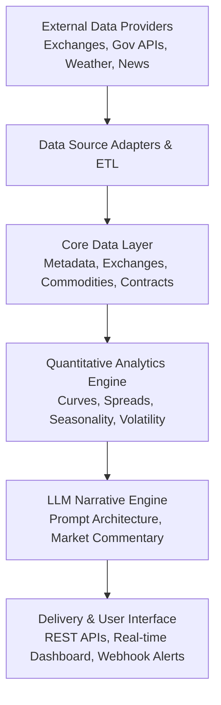

# Commodity Market Intelligence & Quant System

Welcome to the technical architecture and module documentation for the **Commodity Market Intelligence, Quantitative Research & LLM Market Narrative System**.

!!! warning "Standard Disclaimer & Regulatory Notice"
    **This platform is strictly an analytical research, workflow automation, and quantitative intelligence tool.**
    
    It is built to make commodity market data processing, curve analysis, and research workflows easier and more efficient. **It does NOT provide financial advice, investment recommendations, buy/sell signals, or "trading calls."** All market data, forward curves, balance sheets, and LLM-generated narratives are for institutional informational and workflow purposes only. Trading physical commodities, futures, and financial derivatives involves substantial risk of loss.

---

## System Overview

This platform is an institutional-grade quantitative research, market surveillance, and AI-driven narrative intelligence system designed for global physical and financial commodity derivatives markets.

---

## Core Architecture Principles

1. **Source Independence (Plug-and-Play Providers)**:
   The database models, business logic, and quantitative engines are strictly agnostic to external data vendors. Any external source (e.g. public APIs, Bloomberg, Refinitiv, CME Datamine, Argus, Platts) is isolated behind an adapter contract. Swapping a data provider requires changing only one adapter function without altering downstream analytics.

2. **Point-in-Time Correctness**:
   Historical observations, market reports, and government balance sheets (e.g., USDA WASDE, EIA Weekly Petroleum Status) preserve exact observation timestamps, release timestamps, and revision histories to eliminate lookahead bias in backtests.

3. **Institutional Precision**:
   Trading vs. settlement schedules, rolled trade dates, exchange holiday calendars, conversion mathematics, and ISO standards (ISO 10383 MIC, ISO 3166-1 country codes, IANA timezones) are strictly modeled.

---

## Platform Modules & Capabilities

| Module | Documentation | Key Capabilities | Status |
| :--- | :--- | :--- | :---: |
| **Core Infrastructure** | [Architecture Guide](modules/core-infrastructure.md) | Django 5.2, PostgreSQL, Docker, Abstract Models, Health Probes | :white_check_mark: Active |
| **Taxonomy & Metadata** | [Taxonomy & Units](modules/taxonomy-and-units.md) | 34 Data Domains, 45 Commodity Units, Conversion Engine, 15 Frequencies | :white_check_mark: Active |
| **Exchanges & Calendars** | [Exchange Master](modules/exchanges-and-calendars.md) | 15 Venues, 18 Sessions, Calendars, Trading vs. Settlement Rules | :white_check_mark: Active |
| **Commodity Master** | Reference Catalog | Physical Commodity Specifications, Deliverable Grade Standards | :construction: In Progress |
| **Futures & Derivatives** | Contract Reference | Active Contract Specifications, Expiry Cycles, Roll Schedules | :soon: Planned |
| **Market Data & Curves** | Quant Analytics | High-frequency OHLCV, Forward Curves, Intraday Volatility Surfaces | :soon: Planned |
| **Supply & Demand** | Balance Sheets | USDA, EIA, IEA, Production/Consumption Fundamentals | :soon: Planned |
| **LLM Market Narratives** | AI Intelligence | Point-in-time Market Commentary, RAG Retrieval, Risk Summaries | :soon: Planned |

