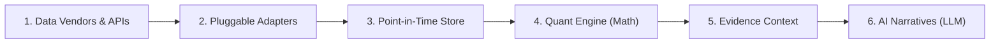

# Commodity Market Intelligence Platform

Welcome to the technical architecture and institutional documentation for the **Commodity Market Intelligence, Quantitative Research & LLM Narrative System**.

!!! warning "Regulatory Notice & Standard Compliance"
    **This platform is strictly an analytical research, workflow automation, and quantitative surveillance tool.**
    It does **NOT** provide financial advice, trading recommendations, buy/sell signals, or "trading calls." All quantitative forward curves, balance sheets, and generative AI summaries are for institutional informational and workflow automation purposes only. Trading physical commodities, futures, and derivatives involves substantial risk of loss.

---

## 1. System Vision

The **Commodity Market Intelligence Platform** models global physical commodities, derivative contract specifications, multi-venue exchange liquidity, and macroeconomic supply/demand fundamentals. 

The architecture enforces a strict mathematical pipeline where **deterministic domain logic, dimensional unit conversion, and calendar math strictly precede any qualitative AI reasoning**. External data vendor independence is guaranteed through pluggable provider adapters, and point-in-time publication tracking eliminates lookahead bias across all research and backtesting workflows.

---

## 2. Recommended Reading: Chapter-Wise System Flow

The documentation is organized in a sequential, chapter-wise flow reflecting how data and analytics travel through the platform:

| Chapter | Title & Scope | Description |
| :---: | :--- | :--- |
| **Chapter 1** | **[End-to-End System Execution Flow](flow-of-execution.md)** | **Start Here!** The dedicated walkthrough of how all modules execute together from ingestion to LLM briefings, with direct links to swap data providers. |
| **Chapter 2** | **Asset & Venue Foundations** | Physical commodity specifications, 15 exchange operating calendars, futures contract specifications, and dimensional unit conversion math. |
| **Chapter 3** | **[Metadata Catalog & Feature Registry](modules/feature-catalog-overview.md)** | The 4-tier data dictionary tracking WHO provides data (`Provider`), WHAT report (`Dataset`), WHERE to fetch it (`Endpoint`), and WHICH metric (`Variable`). |
| **Chapter 4** | **[Ingestion & Observation Store](modules/market-data.md)** | Point-in-time historical and intraday price bars, government storage reports, and CFTC Commitment of Traders (COT) institutional positioning. |
| **Chapter 5** | **[Integration & Swapping Guides](guides/data-sources.md)** | Step-by-step playbooks for swapping market price feeds, fundamental sources, news APIs, and LLM reasoning models (Gemini, Claude, GPT-4o, Ollama), plus adding new features. |
| **Chapter 6** | **[Interactive REST API Reference](api/overview.md)** | Production JSON API reference with live cURL commands and Python `requests` code examples. |

---

## 3. The 4 Non-Negotiable Architectural Directives

1. **Source Independence & Pluggable Providers**:
   Core database models and analytics are completely agnostic to external data vendors. Changing a data source requires implementing one adapter class and changing one `.env` variable without modifying downstream quant code.
2. **Point-in-Time Correctness (Zero Lookahead Bias)**:
   Every observation preserves market trade dates, official release timestamps, and revision histories (`PointInTimeModel`).
3. **Deterministic Arithmetic Precedes LLM Reasoning**:
   Forward curves, crack spreads, and seasonality bands are calculated deterministically. The LLM does not perform mental arithmetic; it reasons over verified quantitative features.
4. **High-Performance Missing Data Standard (Rule 5)**:
   Unobserved metrics are strictly stored as SQL native `NULL`, preserving valid zeros (`0.0`), saving storage, and accelerating SIMD vectorization in Pandas (`np.nan`).

---

  <a href="flow-of-execution/">
    <strong>Begin with Chapter 1: End-to-End System Execution Flow \u2192</strong>
  </a>

