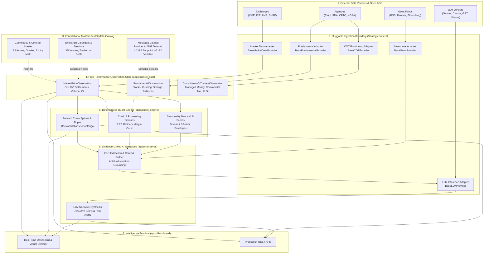

# Commodity Market Intelligence Platform

Welcome to the technical architecture and institutional documentation for the **Commodity Market Intelligence, Quantitative Research & LLM Narrative System**.

!!! warning "Regulatory Notice & Standard Compliance"
    **This platform is strictly an analytical research, workflow automation, and quantitative surveillance tool.**
    It does **NOT** provide financial advice, trading recommendations, buy/sell signals, or "trading calls." All quantitative forward curves, balance sheets, and generative AI summaries are for institutional informational and workflow automation purposes only. Trading physical commodities, futures, and derivatives involves substantial risk of loss.

---

## 1. System Vision & Architecture

The **Commodity Market Intelligence Platform** models global physical commodities, derivative contract specifications, multi-venue exchange liquidity, and macroeconomic supply/demand fundamentals. 

The architecture enforces a strict mathematical pipeline where **deterministic domain logic, dimensional unit conversion, and calendar math strictly precede any qualitative AI reasoning**. External data vendor independence is guaranteed through pluggable provider adapters, and point-in-time publication tracking eliminates lookahead bias across all research and backtesting workflows.

### High-Level System Architecture



---

## 2. End-to-End System Execution Flow

The platform executes across **7 coordinated lifecycle phases**. Below is the exact operational responsibility of each module, its inputs and outputs, and direct links to swap underlying data sources:

```
[Phase A: Foundations]       Taxonomy, Units & Exchange Calendars
        \u2502
[Phase B: Physical & Derivs]   Asset Master & Contract Specifications
        \u2502
[Phase C: Metadata Registry]   Data Map: Provider \u2192 Dataset \u2192 Endpoint \u2192 Variable
        \u2502
[Phase D: Ingestion Store]     Point-in-Time Observations (Prices, Fundamentals, COT)
        \u2502
[Phase E: Quant Analytics]     Forward Curves, Term Structure & Seasonality
        \u2502
[Phase F: News & Catalysts]    Event Calendar & Entity Tagging
        \u2502
[Phase G: AI Intelligence]     Fact-Anchored LLM Narratives & Executive Briefs
```

### Phase A: Foundational Taxonomy & Operating Calendars
* **Taxonomy & Units (`apps/metadata`)**: Provides standard Units of Measure (UOM), observation frequencies, and dimensional mathematical conversion. Deterministic math **must** precede all analysis. Converting 1 Barrel of Crude Oil to Metric Tons or Gallons is strictly calculated using `UnitMaster.convert_to()` before any quantitative model or LLM touches the number.
* **Exchanges & Calendars (`apps/exchanges`)**: Models 15 global commodity exchanges (CME, ICE, LME, SHFE, SGX, etc.), 18 operating trading sessions, and institutional holiday calendars. Resolves active trading days vs. cash settlement days.
  > **Need to change an Exchange Calendar Source?**  
  > See: [How to Swap Exchange Calendar Providers](guides/data-sources.md#7-how-to-swap-exchange-calendar-providers-step-by-step).

### Phase B: Physical Commodities & Derivative Contracts
* **Commodity Master (`apps/commodities`)**: Standardizes physical specifications (API gravity, sulfur content, delivery hubs, crop planting calendars) across 23 physical benchmark commodities.
* **Contracts & Derivatives (`apps/contracts`)**: Models derivative contract specifications, F-Z standardized month codes, algorithmic expiry date calculations, and benchmark index roll schedules (S&P GSCI, Bloomberg BCOM).

### Phase C: Metadata Catalog & Feature Registry
* **Catalog Registry (`apps/providers`, `apps/datasets`, `apps/endpoints`, `apps/variables`)**: Tracks complete data provenance:
  ```
  ProviderMaster (WHO: The Vendor, e.g. EIA, CME, USDA)
     \u2193
  DatasetMaster (WHAT: The Report/Table, e.g. Weekly Petroleum Status Report)
     \u2193
  EndpointMaster (WHERE: The URL & Protocol, e.g. /v2/petroleum/pri/spt/data)
     \u2193
  VariableMaster (WHICH: The Observable Metric, e.g. CRUDE_CUSHING_STOCKS)
  ```
  > **Need to add a brand-new feature or metric to the platform?**  
  > See: [How to Add New Features, Datasets & Variables](guides/adding-new-feature.md).

### Phase D: Ingestion & Time-Series Observation Store
* **Observation Store (`apps/market_data`)**: The quantitative storage layer ingesting and indexing point-in-time time-series:
  - `MarketPriceObservation`: Daily/intraday OHLCV, settlement prices, open interest, and volume.
  - `FundamentalObservation`: Government storage balances, weekly inventory changes, refinery runs.
  - `CommitmentOfTradersObservation`: CFTC institutional trader positioning (Managed Money Net, Commercial Net, % of Open Interest).
* **Point-in-Time & Missing Data Guarantees**:
  - **Rule 2 (Anti-Lookahead)**: Every observation tracks `observation_date` (market trade date) and `publication_time` (official UTC release timestamp).
  - **Rule 5 (Native SQL NULL)**: Preserves exact zero (`0.0`) vs unobserved (`NULL`), accelerating SIMD vectorized analytics in NumPy/Pandas.
  > **Need to switch your Market Data feed (e.g. to CME Datamine or Yahoo)?**  
  > See: [How to Swap Market Data Providers](guides/data-sources.md#3-how-to-swap-market-data-providers-step-by-step).  
  > **Need to switch your Fundamental data source (e.g. to EIA API or Kpler)?**  
  > See: [How to Swap Fundamental Data Providers](guides/data-sources.md#4-how-to-swap-fundamental-data-providers-step-by-step).

### Phase E: Deterministic Quantitative Engine (`apps/quant_engine`)
* Calculates forward curves, backwardation/contango slopes, term structure splines, crack/crush spreads (e.g. 3:2:1 refinery margin), and 5-year historical seasonality envelopes. All math is deterministic; the LLM is never allowed to guess forward curve numbers.

### Phase F: News, Sentiment & Macro Catalysts (`apps/news_intel`)
* Ingests macroeconomic catalyst events (OPEC meetings, USDA WASDE releases, Fed interest rate decisions) and real-time news headlines, automatically linking entities to canonical commodities.
  > **Need to switch your News or Sentiment Feed?**  
  > See: [How to Swap News and Sentiment Providers](guides/data-sources.md#5-how-to-swap-news-and-sentiment-providers-step-by-step).

### Phase G: Evidence-Linked AI Market Narratives (`apps/narratives`)
* Generates executive morning market briefs, supply/demand balance commentary, and risk surveillance summaries.
* **Anti-Hallucination Standard**: Context builder collects verified quantitative metrics (Cushing stocks, 1-week diff, prompt WTI, COT Managed Money Net). The LLM reasons *over* these ground-truth figures using a structured prompt template.
  > **Need to change the LLM Provider or Model (e.g. Gemini, Claude, GPT-4o, Ollama)?**  
  > See: [How to Swap LLM Models and Providers](guides/data-sources.md#6-how-to-swap-llm-models-and-providers-step-by-step).

### Phase H: Surveillance Terminal & REST APIs (`apps/dashboard`, Production APIs)
* High-density dark-theme dashboard displaying system health, asset tickers, pipeline ingestion status, visual data explorer (`/explorer/`), and comprehensive REST API endpoints.

---

## 3. The 4 Non-Negotiable Directives

1. **Source Independence & Pluggable Providers**:
   Core database models and analytics are completely agnostic to external data vendors. Changing a data source requires implementing one adapter class and changing one `.env` variable without modifying downstream quant code.
2. **Point-in-Time Correctness (Zero Lookahead Bias)**:
   Every observation preserves market trade dates, official release timestamps, and revision histories (`PointInTimeModel`).
3. **Deterministic Arithmetic Precedes LLM Reasoning**:
   Forward curves, crack spreads, and seasonality bands are calculated deterministically. The LLM does not perform mental arithmetic; it reasons over verified quantitative features.
4. **High-Performance Missing Data Standard (Rule 5)**:
   Unobserved metrics are strictly stored as SQL native `NULL`, preserving valid zeros (`0.0`), saving storage, and accelerating SIMD vectorization in Pandas (`np.nan`).

---

## 4. Configuration Knobs

To configure or swap any layer of the execution pipeline, update `.env` or Django settings:

```bash
# -------------------------------------------------------------
# PLUGGABLE PROVIDER CONFIGURATION (.env)
# -------------------------------------------------------------
# Market Price Data: 'static', 'yahoo', 'cme_datamine', 'interactive_brokers'
MARKET_DATA_PROVIDER=static

# Fundamental Balances: 'static', 'eia_api', 'kpler', 'usda'
FUNDAMENTAL_DATA_PROVIDER=static

# Commitment of Traders (COT): 'static', 'cftc_socrata'
COT_DATA_PROVIDER=static

# News & Sentiment: 'static', 'rss_feed', 'bloomberg_news', 'newsapi'
NEWS_PROVIDER=static

# LLM Reasoning Engine: 'gemini', 'claude', 'openai', 'ollama'
LLM_PROVIDER=gemini
LLM_MODEL=gemini-2.0-flash
```
