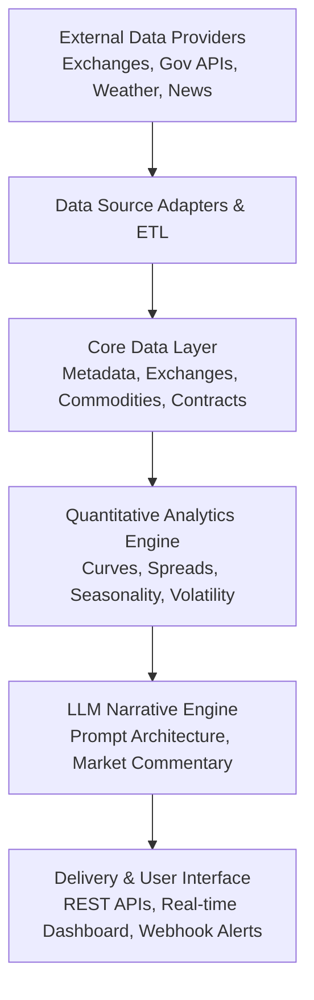

# Commodity Market Intelligence & Quant System

Welcome to the technical architecture and module documentation for the **Commodity Market Intelligence, Quantitative Research & LLM Market Narrative System**.

!!! warning "Standard Disclaimer & Regulatory Notice"
    **This platform is strictly an analytical research, workflow automation, and quantitative intelligence tool.**
    
    It is built to make commodity market data processing, curve analysis, and research workflows easier and more efficient. **It does NOT provide financial advice, investment recommendations, buy/sell signals, or "trading calls."** All market data, forward curves, balance sheets, and LLM-generated narratives are for institutional informational and workflow purposes only. Trading physical commodities, futures, and financial derivatives involves substantial risk of loss.

---

## System Description

The **Commodity Market Intelligence & Quantitative Platform** is an enterprise-grade quantitative research, physical commodity surveillance, forward curve analytics, and AI-driven narrative intelligence platform. Built on strict institutional principles, the system models global physical commodities, derivative contract specifications, multi-venue exchange liquidity, and macroeconomic supply/demand fundamentals. 

The architecture enforces a strict mathematical pipeline where deterministic domain logic, dimensional unit conversion, and calendar math strictly precede any qualitative AI reasoning. External data vendor independence is guaranteed through pluggable provider adapters, and point-in-time publication tracking eliminates hindsight and lookahead bias across all research and backtesting workflows.

---

## What It Is Capable Of

* **Multi-Asset & Multi-Venue Normalization**: Harmonizing heterogeneous physical commodity specifications, delivery hubs, chemical grade thresholds, and trading units across major global exchanges (CME, NYMEX, CBOT, ICE, LME, BMD, MCX, SGX, SHFE).
* **Deterministic Forward Curve & Term Structure Modeling**: Generating continuous forward curves, term structure spreads, calendar rolls, and seasonal basis analysis without lookahead bias.
* **Complex Expiry & Calendar Arithmetic**: Computing exact contract last trading days, notice days, and physical/cash settlement dates based on exchange holiday rules and astro-financial dark days (e.g. Good Friday, holiday shifts).
* **Multi-Exchange Fungibility & Arbitrage Surveillance**: Tracking cross-listed physical assets, pricing unit conversions, and monitoring liquid vs illiquid contracts using ADV (Average Daily Volume) and Open Interest (OI) metrics.
* **Strict Dimensional Unit Conversion**: Deterministically executing mathematical transformations across mass, volume, energy, and currency dimensions before data feeds into analytics models.
* **Evidence-Linked AI Narrative Generation**: Generating macroeconomic market summaries and executive briefings where every qualitative LLM claim is linked to verifiable quantitative metrics, historical releases, and audit trails.
* **Vendor-Agnostic Extensibility**: Ingesting market and fundamental data from any vendor (CME Datamine, ICE, Bloomberg, Refinitiv, USDA, EIA) via swappable provider contracts without changing database schemas or analytical engines.

---

## Features of the System

* **Pluggable Provider Architecture**: Implements Strategy + Factory patterns with strongly-typed Data Transfer Objects (DTOs), enabling zero-friction data vendor swapping and offline resilience.
* **Point-in-Time Correctness**: Tracks observation timestamps, publication dates, and ingestion audit trails via `PointInTimeModel` to guarantee zero lookahead bias in quantitative research.
* **Deterministic Unit Conversion Engine**: Provides 45 canonical units of measure (energy, mass, volume, currency) with strict dimensional validation (`UnitMaster.convert_to()`) prior to AI reasoning.
* **Global Exchange & Calendar Engine**: Canonical modeling for 15 global commodity exchanges, 18 operating sessions, civic vs trading holidays, and astronomical settlement date roll rules.
* **Physical Commodity Master**: Canonical specifications for 23 physical benchmark commodities across 7 sectors, including chemical grade standards, delivery hubs, and crop seasonality.
* **Multi-Venue Fungibility & Liquidity Filtering**: Maps cross-exchange listings with localized lot sizes and currency quotes, tracking ADV and Open Interest to isolate active liquidity.
* **Futures & Contract Master (Phase 5)**: Canonical derivative specifications, standard commodity month codes (F-Z), institutional expiry date calculation, and benchmark index roll schedules (GSCI, BCOM).
* **Dataset Master & Catalog (Phase 6)**: Canonical registry of 23 benchmark datasets, multi-asset commodity linkages, update cadences, ingestion modes, and pipeline SLAs.
* **Real-Time Intelligence Terminal**: High-density dark-theme surveillance dashboard displaying operational telemetry, database health, pipeline metrics, and system diagnostics.
* **High-Performance REST API Suite**: Production-grade endpoints for metadata, exchanges, commodities, contract specifications, and forward delivery cycles with rich filtering.
* **Fact-Anchored LLM Market Narratives**: Evidence-linked commentary engine anchoring generative narrative synthesis directly to quantitative features and official data releases.
* **Production MkDocs Documentation Suite**: Interactive documentation site deployed to GitHub Pages with interactive cURL/Python API consoles and provider integration guides.

---

## Core Architecture Principles

1. **Source Independence (Plug-and-Play Providers)**:
   The database models, business logic, and quantitative engines are strictly agnostic to external data vendors. Any external source (e.g. public APIs, Bloomberg, Refinitiv, CME Datamine, Argus, Platts) is isolated behind an adapter contract. Swapping a data provider requires changing only one adapter function without altering downstream analytics.

2. **Point-in-Time Correctness**:
   Historical observations, market reports, and government balance sheets (e.g., USDA WASDE, EIA Weekly Petroleum Status) preserve exact observation timestamps, release timestamps, and revision histories to eliminate lookahead bias in backtests.

3. **Deterministic Precedence**:
   Quantitative forward curve slopes, crack/crush spreads, carrying charges, seasonality curves, and supply/demand balances are computed deterministically before qualitative LLM reasoning.

4. **Institutional Precision**:
   Trading vs. settlement schedules, rolled trade dates, exchange holiday calendars, conversion mathematics, and ISO standards (ISO 10383 MIC, ISO 3166-1 country codes, IANA timezones) are strictly modeled.

---

## Platform Modules & Capabilities

| Module | Documentation | Key Capabilities | Status |
| :--- | :--- | :--- | :---: |
| **Core Infrastructure** | [Architecture Guide](modules/core-infrastructure.md) | Django 5.2, PostgreSQL, Docker, Abstract Models, Health Probes | :white_check_mark: Active |
| **Taxonomy & Metadata** | [Taxonomy & Units](modules/taxonomy-and-units.md) | 34 Data Domains, 45 Commodity Units, Conversion Engine, 15 Frequencies | :white_check_mark: Active |
| **Exchanges & Calendars** | [Exchange Master](modules/exchanges-and-calendars.md) | 15 Venues, 18 Sessions, Calendars, Trading vs. Settlement Rules | :white_check_mark: Active |
| **Commodity Master** | [Physical Commodities](modules/commodity-master.md) | 23 Commodities, Grade Chemistry, Multi-Exchange Listings | :white_check_mark: Active |
| **Futures & Derivatives** | [Futures & Contract Specifications](modules/contracts-and-derivatives.md) | 25 Benchmark Specs, 200+ Prompt Expiries, Algorithmic Rules, Roll Schedules | :white_check_mark: Active |
| **Dataset Master & Catalog** | [Dataset Master](modules/dataset-master.md) | 23 Benchmark Datasets, Multi-Asset Linkages, Release Schedules, SLAs | :white_check_mark: Active |
| **Market Data & Curves** | Quant Analytics | High-frequency OHLCV, Forward Curves, Intraday Volatility Surfaces | :soon: Planned |
| **Supply & Demand** | Balance Sheets | USDA, EIA, IEA, Production/Consumption Fundamentals | :soon: Planned |
| **LLM Market Narratives** | AI Intelligence | Point-in-time Market Commentary, RAG Retrieval, Risk Summaries | :soon: Planned |
