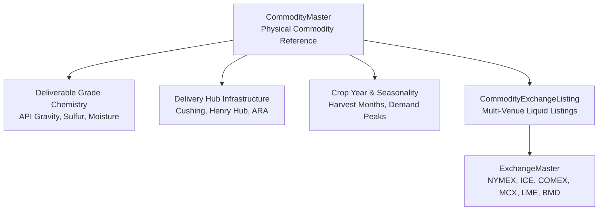

# Commodity Master & Deliverable Specifications

The `apps/commodities` module establishes the canonical catalog of global physical commodities, deliverable grade chemistry specifications, pricing hub infrastructure, crop year seasonality profiles, and multi-venue exchange listings.

!!! tip "Looking for Financial Futures & Derivative Contract Specifications?"
    This document covers the canonical **physical underlying commodity** definitions (chemical grades, physical delivery hubs, and multi-exchange listings).
    
    For exchange-traded derivative contract specifications (symbols, contract sizes, tick values, standard trading month codes F–Z, and algorithmic expiry date calculation rules), see the [Futures & Contract Specifications](contracts-and-derivatives.md) module.

---

## 1. Domain Concept & Architectural Role

Commodity derivative pricing, physical cash basis calculation, and forward curve construction depend on an exact understanding of the **underlying physical commodity**.

Unlike equities, which are identical claims on a corporate entity, physical commodities possess complex real-world dimensions:
* **Quality & Chemistry Variations**: Crude oil differs radically by density (API gravity) and sulfur content (sweet vs. sour). Grains vary by moisture content, test weight, and broken kernels.
* **Delivery Infrastructure**: Physical futures contracts settle via title transfer at specific pipeline terminals, port elevators, or exchange-licensed vaults.
* **Biological & Weather Cycles**: Crops undergo annual planting, pollination, and harvest cycles that dictate seasonal inventory build and price tendencies.
* **Multi-Venue Fungibility & Arbitrage**: The same physical commodity (e.g. Gold, WTI Crude, Copper) trades actively across multiple global exchanges (COMEX, NYMEX, LME, MCX India, SHFE Shanghai) with varying contract sizes, currencies, and settlement mechanisms.



---

## 2. Model Architecture & Entity Relationships

The module implements a consolidated, high-performance architecture:

### `CommodityMaster`
The primary reference model representing the underlying physical good. Inherits from `UUIDModel` and `TimeStampedModel`:

* **Classification**:
  - `code`: Unique canonical symbol (e.g. `CL`, `BRENT`, `NG`, `CORN`, `SOYBEANS`, `COPPER`, `GOLD`).
  - `name`: Full commercial title (e.g. `Light Sweet Crude Oil (WTI)`).
  - `sector`: Sector classification (`ENERGY`, `AGRICULTURE`, `LIVESTOCK`, `METALS_BASE`, `METALS_PRECIOUS`, `FREIGHT_BULK`, `ENVIRONMENTAL`).
  - `group`: Industry grouping (e.g. `CRUDE_OIL`, `REFINED_PRODUCTS`, `GRAINS`, `OILSEEDS`, `SOFTS`, `BASE_METALS`, `PRECIOUS_METALS`).
* **Benchmark Units & Tick Math**:
  - `primary_exchange`: Global reference pricing venue (ForeignKey to `ExchangeMaster`).
  - `base_unit`: Physical base unit of measure (ForeignKey to `UnitMaster`, e.g. `BBL`, `MMBTU`, `BU`, `MT`, `TOZ`, `LB`).
  - `pricing_unit`: Standard price quotation unit (ForeignKey to `UnitMaster`, e.g. `USD_BBL`, `USD_MMBTU`, `USC_BU`, `USD_TOZ`, `USD_MT`).
  - `standard_lot_size` & `standard_lot_unit`: Benchmark contract size (e.g. 1,000 BBL, 5,000 BU, 100 TOZ).
  - `minimum_tick_size` & `tick_value`: Minimum price increment and monetary value per contract (e.g. $10.00 for WTI, $12.50 for Corn).
  - `settlement_method`: Default settlement convention (`PHYSICAL` vs. `CASH`).
* **Deliverable Grade & Chemistry**:
  - `deliverable_grade_standard`: Standard specification text (e.g. *"U.S. No. 2 Yellow Corn at par"*).
  - `quality_specifications`: Structured JSON defining chemical and physical thresholds (e.g. `api_gravity_min`, `sulfur_pct_max`, `moisture_pct_max`).
* **Delivery Hub Infrastructure**:
  - `primary_delivery_hub`: Benchmark pricing terminal (e.g. *"Cushing, Oklahoma"*, *"Henry Hub, Louisiana"*).
  - `delivery_hub_details`: Structured JSON detailing pipeline connections, terminal storage, and transfer mechanisms.
* **Crop & Production Seasonality**:
  - `crop_year_start_month`: Calendar month marking crop year commencement (e.g. `9` for US Corn/Soybeans).
  - `peak_production_months` & `peak_demand_months`: Array of calendar months capturing seasonal supply/demand concentration.
  - `seasonality_notes`: Institutional analysis of recurring basis and price tendencies.

---

### `CommodityExchangeListing`
Models the **same physical commodity trading across multiple liquid exchanges**, capturing venue-specific contract parameters:

* `commodity`: ForeignKey to `CommodityMaster`.
* `exchange`: ForeignKey to `ExchangeMaster` (e.g. COMEX, MCX, SHFE).
* `ticker_symbol`: Venue-specific ticker (e.g. `GC` on COMEX, `GOLD` on MCX, `AU` on SHFE).
* `contract_size` & `contract_unit`: Local lot specification (e.g. COMEX Gold = 100 TOZ; MCX Gold = 32.15 TOZ / 1 kg).
* `settlement_method`: Local settlement rule (e.g. NYMEX WTI is `PHYSICAL`, while MCX Crude Oil is `CASH`-settled against NYMEX).
* `is_primary_benchmark`: Boolean flag identifying the global price-discovery venue.
* `liquidity_tier`: Volume classification (`BENCHMARK`, `HIGH`, `ACTIVE`).
* `typical_daily_volume` & `typical_open_interest`: Benchmark liquidity metrics, filtering out dormant contracts.
* `trading_currency`: Local currency ISO code (`USD`, `INR`, `CNY`, `EUR`, `MYR`, `BRL`).

---

## 3. Global Benchmark Coverage

The seeded catalog encompasses 23 benchmark commodities across all 7 sectors with 44 active exchange listings:

| Sector | Commodity Code | Common Title | Primary Venue | Multi-Exchange Listings | Settlement |
| :--- | :--- | :--- | :---: | :--- | :---: |
| **Energy** | `CL` | Light Sweet Crude Oil (WTI) | NYMEX | NYMEX, MCX India | Physical (NYMEX) / Cash (MCX) |
| **Energy** | `BRENT` | Brent Crude Oil | ICE Europe | ICE Europe, NYMEX, MCX India | Cash (ICE Brent Index) |
| **Energy** | `NG` | Henry Hub Natural Gas | NYMEX | NYMEX, MCX India | Physical |
| **Energy** | `RB` | RBOB Gasoline | NYMEX | NYMEX | Physical |
| **Energy** | `HO` | Ultra Low Sulfur Diesel | NYMEX | NYMEX | Physical |
| **Energy** | `GO` | Low Sulfur Gasoil | ICE Europe | ICE Europe | Physical (ARA Barge) |
| **Agriculture** | `CORN` | Corn No. 2 Yellow | CBOT | CBOT, B3 Brasil | Physical (CBOT) / Cash (B3) |
| **Agriculture** | `SOYBEANS` | Soybeans No. 1/2 Yellow | CBOT | CBOT, B3 Brasil, DCE China | Physical |
| **Agriculture** | `SOYOIL` | Soybean Oil | CBOT | CBOT | Physical |
| **Agriculture** | `WHEAT_SRW` | Soft Red Winter Wheat | CBOT | CBOT | Physical |
| **Agriculture** | `PALM_OIL` | Crude Palm Oil (FCPO) | BMD | Bursa Malaysia, DCE, MCX | Physical (BMD) / Cash (MCX) |
| **Softs** | `COFFEE_ARABICA` | Coffee 'C' (Arabica) | ICE US | ICE US, B3 Brasil | Physical |
| **Softs** | `SUGAR_11` | Raw Sugar No. 11 | ICE US | ICE US | Physical |
| **Softs** | `COCOA` | Cocoa | ICE US | ICE US, ICE Europe | Physical |
| **Softs** | `COTTON_2` | Cotton No. 2 | ICE US | ICE US | Physical |
| **Precious Metals** | `GOLD` | Gold (100 Troy Oz) | COMEX | COMEX, MCX India, SHFE Shanghai | Physical |
| **Precious Metals** | `SILVER` | Silver (5,000 Troy Oz) | COMEX | COMEX, MCX India, SHFE Shanghai | Physical |
| **Base Metals** | `COPPER` | High Grade Copper Cathode | LME | LME, COMEX, SHFE, MCX | Physical |
| **Base Metals** | `ALUMINUM` | Primary High Grade Aluminum | LME | LME, SHFE | Physical |
| **Livestock** | `LIVE_CATTLE` | Live Cattle | CME | CME | Physical |
| **Livestock** | `LEAN_HOGS` | Lean Hogs | CME | CME | Cash (CME Lean Hog Index) |
| **Bulk** | `IRON_ORE` | Iron Ore 62% Fe CFR China | SGX | SGX Singapore, DCE China | Cash (TSI Index) |
| **Environmental** | `EUA_CARBON` | EU Carbon Allowance (EUA) | EEX | EEX Leipzig, ICE Europe | Physical (EU Registry) |

---

## 4. Seeding & Management Operations

Populate canonical commodities and multi-exchange listings:

```powershell
# Standard idempotent seeding
.\.venv\Scripts\python manage.py seed_commodities

# Reset and re-seed clean catalog
.\.venv\Scripts\python manage.py seed_commodities --clear
```
