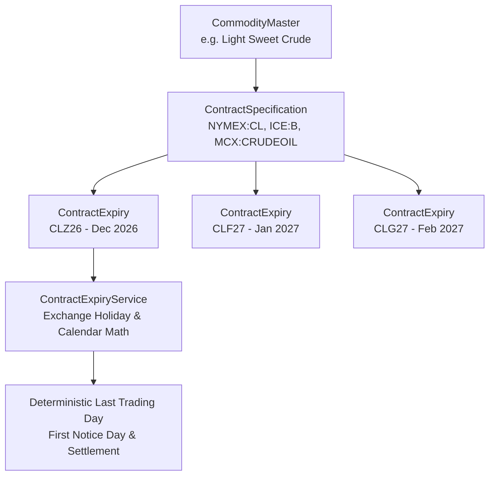

# Contracts & Derivatives Master

The `apps/contracts` module establishes the canonical catalog of commodity futures contract specifications, standardized month codes (F–Z), prompt delivery cycles, deterministic expiry calculation arithmetic, and benchmark forward curve roll conventions.

---

## 1. Domain Concept & Architectural Role

While `apps/commodities` defines the underlying physical asset (e.g. Light Sweet Crude Oil, Yellow Corn, Gold bullion), financial markets trade **derivative contracts** with specific delivery months, lot sizes, tick sizes, and termination schedules.

A single physical commodity can underpin multiple derivative instruments:
* **Benchmark Futures**: Standardized, exchange-traded commitments for physical delivery or cash settlement (e.g., NYMEX WTI `CL`, ICE Brent `B`, CBOT Corn `ZC`).
* **Active Delivery Cycles**: While some contracts trade in all 12 calendar months (e.g., Crude Oil, Natural Gas), agricultural contracts trade in specific seasonal cycles (e.g., Corn trades March `H`, May `K`, July `N`, September `U`, December `Z`).
* **Institutional Expiry Rules**: Trading cessation dates follow precise, exchange-mandated calendar rules that account for exchange holidays and weekend shifts.
* **Continuous Forward Curves**: Creating continuous benchmark series requires deterministic index roll windows (e.g., S&P GSCI rolls from the 5th to the 9th business day of each month).

---

## 2. Standard Commodity Month Codes (F–Z)

Commodity derivatives globally adhere to a standardized single-letter month coding system:

| Letter Code | Month | Primary Seasonal Relevance | Example Symbol |
| :---: | :--- | :--- | :--- |
| **F** | January | Winter heating demand / Southern hemisphere planting | `CLF27`, `ZSF27` |
| **G** | February | Winter inventory drawdowns / Livestock cycles | `GCG27`, `LEG27` |
| **H** | March | Spring planting transition / First Q1 delivery | `ZCH27`, `SBO27` |
| **J** | April | US Spring field preparation / Sugar crushing | `GCJ27`, `LEJ27` |
| **K** | May | US corn & soybean planting window | `ZCK27`, `ZSK27` |
| **M** | June | North American summer weather market / LME mid-year | `GCM27`, `CAM27` |
| **N** | July | US corn pollination / Northern hemisphere summer peak | `ZCN27`, `CTN27` |
| **Q** | August | US soybean pod setting / Peak summer power demand | `GCQ27`, `HEQ27` |
| **U** | September | US crop harvest commencement / Autumn refinery maintenance | `ZCU27`, `CLU27` |
| **V** | October | Peak US harvest pressure / Heating season build | `GCV27`, `SBV27` |
| **X** | November | South American planting progress / Final crop size | `ZSX27`, `CLX27` |
| **Z** | December | Annual index rebalancing / EUA compliance deadline | `CLZ26`, `FEUAZ26` |

---

## 3. Algorithmic Expiry Calculation Engine

The platform implements `ContractExpiryService`, which integrates directly with `ExchangeCalendarService` to compute exact trading days and delivery windows deterministically without lookahead bias:

### Implemented Institutional Expiry Rules

1. **`DAY_OF_PRIOR_MONTH_WITH_BUS_OFFSET`** (e.g. NYMEX Light Sweet Crude Oil `CL`):
   Trading terminates on the **25th calendar day** of the month preceding the delivery month. If the 25th is a weekend or an official exchange holiday, trading ceases on the **3rd business day prior** to the 25th.
2. **`LAST_BUSINESS_DAY_OF_TWO_MONTHS_PRIOR`** (e.g. ICE Brent Crude `B`):
   Trading ceases on the **last business day of the second month preceding the delivery month** (e.g., February delivery contract ceases on the last business day of December).
3. **`BUSINESS_DAY_BEFORE_DAY_OF_MONTH`** (e.g. CBOT Corn `ZC`, Soybeans `ZS`, Wheat `ZW`):
   Trading terminates on the **business day immediately preceding the 15th calendar day** of the contract delivery month.
4. **`DAYS_BEFORE_MONTH_START`** (e.g. NYMEX Henry Hub Natural Gas `NG`, ICE Coffee `KC`):
   Trading terminates exactly $N$ business days prior to the first calendar day of the contract delivery month (e.g. 3 business days for Natural Gas).
5. **`LAST_BUSINESS_DAY_OF_PRIOR_MONTH`** (e.g. NYMEX RBOB `RB`, Heating Oil `HO`, ICE Sugar `SB`):
   Trading ceases on the final business day of the calendar month immediately preceding delivery.
6. **`THIRD_WEDNESDAY_OF_MONTH`** (e.g. LME Copper `CA`, Aluminum `AH`):
   Settles on the third Wednesday of the delivery month, rolling to the preceding business day if an exchange holiday.
7. **`FIFTH_BUSINESS_DAY_BEFORE_MONTH_END`** (e.g. COMEX Gold `GC`, Silver `SI`, Copper `HG`):
   Trading terminates the third business day prior to the final business day of the delivery month.

---

## 4. Benchmark Forward Curve Roll Schedules

To build continuous time series (e.g., Front-Month continuous WTI `CL01`, Second-Month `CL02`), market participants follow systematic index roll schedules:

* **S&P GSCI Roll Window**: 5th through 9th business day of each calendar month (rolls 20% of position each day).
* **Bloomberg Commodity Index (BCOM) Roll Window**: 6th through 10th business day of each month.
* **LME Prompt Window**: Daily prompt contracts roll into the Third Wednesday prompt monthly settlement.
* **Agricultural Seasonal Rolls**: Grains roll only during active contract months (e.g., rolling March `H` into May `K` during February/early March).

---

## 5. Model Reference & Database Tables

### `ContractSpecification` (`contracts_specification`)

| Field | Type | Description |
| :--- | :--- | :--- |
| `id` | `UUID` | Primary key. |
| `commodity` | `ForeignKey` | Underlying physical commodity (`apps.commodities.CommodityMaster`). |
| `exchange` | `ForeignKey` | Operating venue (`apps.exchanges.ExchangeMaster`). |
| `symbol_root` | `CharField(20)` | Exchange ticker root (e.g. `CL`, `B`, `NG`, `ZC`, `GC`). |
| `name` | `CharField(150)` | Full commercial name (e.g. *"Light Sweet Crude Oil (WTI) Futures"*). |
| `instrument_type` | `CharField(30)` | `FUTURES`, `OPTIONS_AMERICAN`, `OPTIONS_EUROPEAN`, `CALENDAR_SPREAD`. |
| `contract_size` | `Decimal(14,4)` | Multiplier (e.g. `1000.0` for WTI = 1,000 bbl). |
| `contract_unit` | `ForeignKey` | Unit of measure for quantity (`BBL`, `BU`, `MT`, `TOZ`). |
| `price_quote_unit` | `ForeignKey` | Price quotation unit (`USD_BBL`, `USC_BU`, `USD_TOZ`). |
| `minimum_tick_size` | `Decimal(12,6)` | Minimum allowable price fluctuation (e.g. `0.01`). |
| `tick_value` | `Decimal(12,4)` | Monetary tick value per contract (e.g. `$10.00`). |
| `trading_currency` | `CharField(5)` | ISO currency (e.g. `USD`, `INR`, `EUR`, `MYR`). |
| `settlement_method` | `CharField(20)` | Binary: `PHYSICAL` vs `CASH`. |
| `trading_months` | `CharField(100)` | `"ALL_12"` or comma-separated letter codes (e.g. `"H,K,N,U,Z"`). |
| `expiry_rule` | `CharField(50)` | Rule choice from `ExpiryRuleType`. |
| `expiry_rule_parameter` | `IntegerField` | Parameter used by the calculation algorithm. |
| `default_roll_rule` | `CharField(100)` | Standard roll schedule convention. |

### `ContractExpiry` (`contracts_expiry`)

| Field | Type | Description |
| :--- | :--- | :--- |
| `id` | `UUID` | Primary key. |
| `specification` | `ForeignKey` | Parent contract specification. |
| `contract_symbol` | `CharField(30)` | Standard ticker symbol (e.g. `CLZ26`, `BRENTF27`, `ZCH27`). |
| `contract_year` | `SmallInteger` | 4-digit contract delivery year (e.g. `2026`). |
| `contract_month` | `SmallInteger` | Delivery month (1–12). |
| `contract_month_code` | `CharField(2)` | Letter code (`F` through `Z`). |
| `last_trading_day` | `DateField` | Calculated date of trading termination. |
| `first_notice_day` | `DateField` | First notice date for physical delivery (null for cash). |
| `last_delivery_day` | `DateField` | Final delivery date for physical transfer (null for cash). |
| `final_settlement_date` | `DateField` | Date of final settlement invoice or cash clearing. |
| `is_expired` | `BooleanField` | True if contract has completed settlement. |
