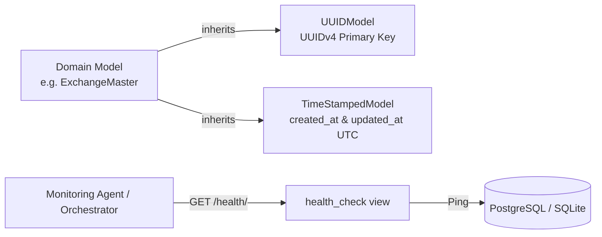

# Core Infrastructure & Base Architecture

The `apps/core` module delivers the fundamental architectural substrate for the entire commodity intelligence platform.

---

## 1. Module Overview & Purpose

Institutional commodity data pipelines process millions of tick-level and daily observations across distributed microservices. This module guarantees:

- **Universal Entity Tracking**: All business entities use universally unique identifiers (UUIDv4) to prevent integer enumeration attacks and enable seamless cross-database replication.
- **Audit Trails**: Every database table automatically tracks its creation and last-modified UTC timestamps.
- **System Health Probes**: High-speed, lightweight endpoints for Kubernetes, Docker health checks, and load balancers to monitor database and cache connectivity.

---

## 2. Architecture & Data Flow



---

## 3. Core Models & Abstractions

### `UUIDModel`
Located in `apps/core/models.py`. An abstract Django model providing a cryptographically random UUID primary key:

```python
class UUIDModel(models.Model):
    id = models.UUIDField(
        primary_key=True,
        default=uuid.uuid4,
        editable=False,
        help_text="Universally unique record identifier (UUIDv4)",
    )
```

### `TimeStampedModel`
Located in `apps/core/models.py`. An abstract Django model maintaining timezone-aware UTC audit fields:

```python
class TimeStampedModel(models.Model):
    created_at = models.DateTimeField(auto_now_add=True)
    updated_at = models.DateTimeField(auto_now=True)
```

### `DataQualityStatus`
Standardized enumeration for data curation and provenance:
- `RAW`: Unprocessed ingest from external source.
- `VALIDATED`: Checked against schema constraints and range bounds.
- `ANOMALOUS`: Flagged by statistical outliers or unexpected variance.
- `OVERRIDDEN`: Manually adjusted by research analyst with audit log.

---

## 4. How to Extend / Change Infrastructure Components

### Adding a Custom Health Diagnostic Probe
If you want to add a health check for an external message queue (e.g. Celery / Redis) or database cluster:

- **Target File**: `apps/core/views.py`
- **Target Function**: `SystemStatusAPIView.get(self, request)`

#### Implementation Contract:
```python
# In apps/core/views.py:

class SystemStatusAPIView(APIView):
    def get(self, request):
        # 1. Probe database
        db_healthy = self._check_db()
        
        # 2. Probe Redis / Celery (Example extension)
        redis_healthy = self._check_redis()
        
        overall_healthy = db_healthy and redis_healthy
        
        return Response({
            "status": "online" if overall_healthy else "degraded",
            "services": {
                "database": db_healthy,
                "cache_redis": redis_healthy,
            }
        }, status=200 if overall_healthy else 503)
```
