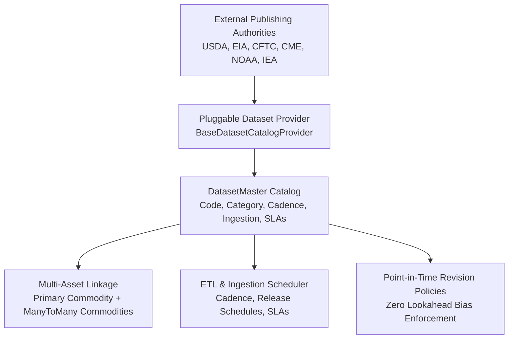

# Dataset Master & Catalog Architecture

The `apps/datasets` module establishes the canonical catalog of commodity market datasets, reporting cadences, ingestion protocols, source authorities, point-in-time revision policies, and service level agreements (SLAs).

---

## 1. Domain Concept & Architectural Role

Commodity intelligence systems rely on heterogeneous data streams spanning financial market prices, governmental fundamental balance sheets, corporate inventory surveys, satellite weather observations, customs trade flows, and regulatory trader positioning.

Without a centralized catalog, quantitative research and ETL pipelines suffer from severe architectural challenges:
* **Vendor Coupling**: Codebases become hardcoded to specific vendor table schemas and delivery mechanisms.
* **Lookahead Bias**: Backtesting engines evaluate historical data using the release date or revision status available today rather than at the historical point in time.
* **Lack of Multi-Asset Clarity**: Crucial reports like the **USDA WASDE** (World Agricultural Supply and Demand Estimates) or the **CFTC Commitments of Traders (COT)** cover dozens of commodities simultaneously; systems that force a strict 1-to-1 dataset-to-commodity mapping break down.
* **Pipeline Blindness**: Data pipelines fail silently when releases are delayed or schemas drift without clear SLAs or cadence definitions.

The `DatasetMaster` solves these challenges by acting as the single source of truth for **dataset definitions and governance**:



---

## 2. Canonical Data Categories

Datasets are categorized into 9 distinct functional domains:

| Category Code | Category Name | Typical Source Authorities | Representative Benchmark Series |
| :--- | :--- | :--- | :--- |
| `MARKET_PRICES` | Market Prices & Spreads | CME, ICE, LME, SHFE, MCX | Daily settlement prices, continuous front-month curves, intraday tick bars. |
| `INVENTORIES_STOCKS` | Inventories & Warehouse Stocks | EIA, LME, API, USDA | US Crude inventories (Cushing), LME registered warrant stocks, port grain elevator stocks. |
| `SUPPLY_DEMAND` | Supply & Demand Balances | USDA, IEA, OPEC, CONAB | Global balance sheets, ending stocks, crush volumes, domestic disappearance. |
| `TRADE_FLOWS` | Trade Flows & Customs | USDA FAS, General Administration of Customs | Weekly export inspections, vessel tracking, bilateral trade matrices. |
| `POSITIONING` | Trader Positioning & COT | CFTC, ICE Europe | Disaggregated COT, managed money net length, commercial hedging commitments. |
| `WEATHER_CLIMATE` | Weather & Satellite Climate | NOAA, ECMWF, NASA | Soil moisture anomalies, cumulative precipitation, ENSO (El Niño / La Niña) indices. |
| `MACROECONOMIC` | Macroeconomic & FX Rates | Federal Reserve (FRED), IMF, World Bank | US Dollar Index (DXY), shipping freight indices (Baltic Dry Index), central bank interest rates. |
| `PRODUCTION_CAPACITY` | Production & Extraction | Baker Hughes, OPEC, USGS | Active oil/gas rig counts, refinery utilization rates, mine output reports. |
| `ENVIRONMENTAL` | Environmental & Emissions | EU ETS, California CARB | Carbon credit allowances, renewable fuel standard (RFS) RIN generation. |

---

## 3. Update Cadences, Ingestion Modes & SLAs

### Update Cadences

| Cadence | Description | Example Datasets |
| :--- | :--- | :--- |
| `REALTIME_STREAM` | Continuous tick or streaming trade feed. | Order book depth, real-time FX/futures ticks. |
| `HOURLY` | Hourly periodic snapshots. | Pipeline flows, intraday electricity nodal prices. |
| `DAILY_EOD` | Daily closing/settlement snapshot. | Exchange settlement prices, official currency fixings. |
| `WEEKLY_FIXED_DAY` | Released weekly on a predetermined calendar day. | EIA Petroleum (Wed 10:30 ET), CFTC COT (Fri 15:30 ET). |
| `MONTHLY_CALENDAR_DAY` | Released monthly around a specific calendar date. | USDA WASDE (9th-12th of month), OPEC Monthly Oil Report. |
| `QUARTERLY` | Quarterly institutional updates. | USDA Grain Stocks, corporate inventory filings. |
| `SEASONAL_CROP_CYCLE` | Published only during the active agricultural season. | USDA NASS Crop Progress & Condition (April–November). |
| `EVENT_DRIVEN` | Published on an ad-hoc or unannounced basis. | Emergency OPEC+ ministerial communiqués, unscheduled refinery outages. |

### Ingestion Modes & Pipeline Architecture

The platform categorizes how data enters the analytical pipeline:

1. **`PULL_SCHEDULED_BATCH`**: Cron or Celery Beat scheduler queries remote REST APIs or FTP servers at scheduled publication times.
2. **`PULL_POLL_CHANGE_DETECTION`**: High-frequency polling utilizing HTTP `ETag` or `If-Modified-Since` headers to ingest data within seconds of publication.
3. **`PUSH_WEBHOOK_STREAM`**: Inbound webhook receivers or streaming sockets push observations into the platform.
4. **`PUSH_MESSAGE_QUEUE`**: Enterprise event streaming via Apache Kafka or RabbitMQ.
5. **`MANUAL_INGESTION`**: Controlled analyst upload portal for bespoke non-digital industry reports.

### SLA & Latency Monitoring

Each dataset defines `sla_max_delay_minutes`:
* **Threshold Calculation**: Measures the elapsed duration between scheduled publication time and completed database ingestion.
* **Automated Alerting**: If the delay exceeds the SLA threshold, system telemetry registers a warning state on the Operations Dashboard.

---

## 4. Multi-Asset & Commodity Linkage

Macroeconomic and governmental reports often cover multiple physical commodities simultaneously. `DatasetMaster` models this flexibility using a dual-link structure:

1. **`primary_commodity` (`ForeignKey`, optional)**: Identifies the single benchmark asset when a dataset is dedicated to one commodity (e.g. Baker Hughes Rig Count -> Crude Oil, LME Copper Stocks -> Copper).
2. **`commodities` (`ManyToManyField`, optional)**: Links all underlying commodities for comprehensive multi-asset balance sheets (e.g., USDA WASDE covers Corn, Soybeans, Wheat, Cotton; CFTC COT covers Energy, Metals, and Ags).

This enables analytical queries like:
```python
# Retrieve all datasets affecting Corn fundamentals
corn_datasets = DatasetMaster.objects.filter(
    Q(primary_commodity__code="CORN") | Q(commodities__code="CORN")
).distinct()
```

---

## 5. Pluggable Catalog Provider Architecture

In accordance with Core Directive #1 (Source Independence), dataset definitions are completely decoupled from storage mechanisms using the Strategy + Factory pattern:

```python
# apps/datasets/providers/base.py
class BaseDatasetCatalogProvider(ABC):
    @abstractmethod
    def get_datasets(self) -> List[RawDatasetSpec]:
        """Fetch all canonical dataset specifications."""
        pass

    @abstractmethod
    def get_dataset(self, code: str) -> Optional[RawDatasetSpec]:
        """Retrieve a single dataset specification by code."""
        pass
```

### Static vs External Catalog Providers

* **`StaticDatasetCatalogProvider`**: Standard built-in provider populating 23 institutional benchmark datasets across energy, agriculture, metals, weather, and macro indicators.
* **Custom Enterprise Providers**: Data teams can implement custom providers that synchronize datasets from AWS Glue Data Catalog, Snowflake Data Marketplace, or internal metadata repositories by implementing `BaseDatasetCatalogProvider` and updating `DATASET_CATALOG_PROVIDER` in settings.

---

## 6. Model Reference & Database Tables

### `DatasetMaster` (`datasets_master`)

| Field | Type | Description |
| :--- | :--- | :--- |
| `id` | `UUID` | Primary key. |
| `code` | `CharField(60)` | Unique canonical identifier (e.g. `USDA_WASDE`, `EIA_WPSR_PETROLEUM`). |
| `name` | `CharField(150)` | Full commercial/institutional title. |
| `description` | `TextField` | Detailed methodology and coverage description. |
| `domain` | `ForeignKey` | Data domain taxonomy classification (`metadata.DataDomainMaster`). |
| `primary_commodity` | `ForeignKey` | Primary benchmark commodity anchor (optional). |
| `commodities` | `ManyToManyField` | All physical commodities covered by this dataset. |
| `exchange` | `ForeignKey` | Associated exchange venue (if venue-specific). |
| `frequency` | `ForeignKey` | Standard temporal frequency (`metadata.FrequencyMaster`). |
| `data_category` | `CharField(40)` | Functional category (`MARKET_PRICES`, `SUPPLY_DEMAND`, etc.). |
| `update_cadence` | `CharField(40)` | Publication frequency (`DAILY_EOD`, `WEEKLY_FIXED_DAY`, etc.). |
| `ingestion_mode` | `CharField(40)` | Acquisition mode (`PULL_SCHEDULED_BATCH`, `PUSH_WEBHOOK_STREAM`, etc.). |
| `release_schedule` | `JSONField` | Structured timing parameters (day, hour, minute, timezone). |
| `retention_policy` | `CharField(40)` | Historical retention rules (`INDEFINITE_POINT_IN_TIME`, etc.). |
| `license_type` | `CharField(40)` | Usage rights (`PUBLIC_DOMAIN`, `PROPRIETARY_COMMERCIAL`, etc.). |
| `point_in_time_enabled`| `BooleanField` | True if publication timestamps and revision tracking are enforced. |
| `supports_revisions` | `BooleanField` | True if source authority issues retroactive revisions. |
| `sla_max_delay_minutes`| `IntegerField` | Maximum tolerable pipeline delay in minutes before warning. |
| `source_authority` | `CharField(150)` | Publishing agency (e.g. `USDA`, `EIA`, `CFTC`, `NOAA`). |
| `documentation_url` | `URLField` | Official agency methodology reference URL. |
| `is_active` | `BooleanField` | True if dataset is active. |
| `display_order` | `IntegerField` | Sorting order in dashboards and tables. |
