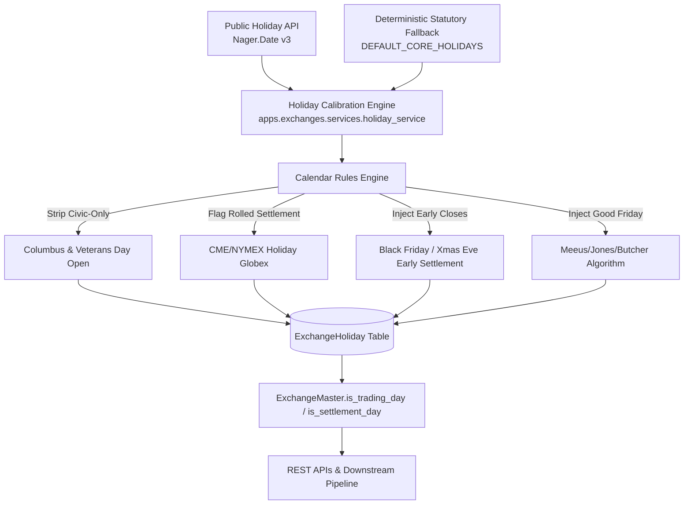

# Exchange Master & Trading Calendars

The `apps/exchanges` module establishes the canonical registry of global commodity execution venues, operating sessions, and institutional trading vs. settlement calendars.

---

## 1. Module Overview & Purpose

Commodity derivatives trading, contract settlement, and multi-asset price discovery are strictly anchored to exchange operating venues and trading calendars.

This module models 15 major global commodity venues across 9 jurisdictions:
- **North America**: `CME`, `NYMEX`, `COMEX`, `CBOT`, `ICE_US`
- **Europe**: `ICE_EU`, `LME`, `EEX`
- **Middle East & Asia-Pacific**: `IFAD` (Abu Dhabi), `BMD` (Bursa Malaysia), `B3` (Brazil), `SGX` (Singapore), `SHFE`, `DCE`, `MCX` (India)

### Public Holiday vs. Exchange Trading Calendar
An institutional exchange calendar is **frequently NOT identical** to a country's public/federal holiday calendar:
1. **Civilian Holidays where Exchanges Remain OPEN**: US exchanges remain open for commodity futures trading on **Columbus Day** and **Veterans Day**.
2. **Trading WITHOUT Settlement (Rolled Trade Dates)**: On Memorial Day, MLK Day, Presidents' Day, and Labor Day, CME/NYMEX/COMEX trade electronically until 12:30 CT without producing an official daily settlement price; trades roll into Tuesday's clearing date.
3. **Trading WITH Early Settlement**: Day after Thanksgiving (Black Friday), Christmas Eve, and New Year's Eve trade abbreviated sessions and establish official early settlement prices.
4. **Split Sessions (MCX India)**: On festival holidays (Holi, Mahashivratri, Eid, Diwali), MCX morning sessions close while evening sessions (17:00–23:30/23:55 IST) remain open with daily settlement.

---

## 2. Architecture & Data Flow



---

## 3. Core Models Reference

### `ExchangeMaster`
- `code`: Canonical symbol (e.g. `NYMEX`, `CME`, `IFAD`, `BMD`, `B3`, `LME`, `MCX`).
- `mic`: ISO 10383 Market Identifier Code (`XNYM`, `XCME`, `IFEU`, `BVMF`, etc.).
- `timezone`: IANA timezone string validated against Python's standard `zoneinfo`.
- `is_trading_day(check_date, product_group=None)`: Evaluates if matching engines operate.
- `is_settlement_day(check_date, product_group=None)`: Evaluates if an official daily settlement price is established.
- `get_market_status(check_date, product_group=None)`: Returns full diagnostic breakdown.

### `ExchangeTradingSession`
- `session_type`: `ELECTRONIC`, `OPEN_OUTCRY`, `SETTLEMENT_WINDOW`, `MAINTENANCE_PAUSE`.
- `start_time_local` / `end_time_local`: Exchange local operating window.

### `ExchangeHoliday`
- `date`: Calendar date of holiday or abbreviated session.
- `is_full_day_closure`: `True` if venue is dark; `False` if partial/holiday session.
- `has_trading`: `True` if electronic matching engines operate.
- `has_settlement`: `True` if official daily settlement prices are established.
- `settlement_rolled_to_next_day`: `True` if trades clear under the next business day's date.
- `affected_product_groups`: Commodity sectors affected (e.g. `ALL`, `ENERGY,METALS`, `AGRICULTURE`, `EVENING_SESSION_OPEN`).
- `early_close_time_local`: Local time of session halt.

---

## 4. Extensibility Guide: How to Change the Data Source

If you want to replace the current default external API ([Nager.Date](https://date.nager.at/)) with an institutional data vendor (e.g. **Bloomberg SIFMA Calendar API**, **Refinitiv DataScope**, or **Exchange Direct RSS/JSON Feeds**):

### Target Location
- **File**: `apps/exchanges/services/holiday_service.py`
- **Class**: `ExchangeHolidaySyncService`
- **Function**: `_fetch_and_store_holidays(cls, exchange: ExchangeMaster, year: int) -> tuple[int, str | None]`

### Function Interface Contract

| Parameter | Type | Description |
| :--- | :--- | :--- |
| `exchange` | `ExchangeMaster` | The database record for the venue (contains `exchange.code`, `exchange.mic`, `exchange.country`, `exchange.timezone`). |
| `year` | `int` | The 4-digit calendar year (e.g. `2026`). |
| **Returns** | `tuple[int, str \| None]` | Tuple containing: `(synced_record_count: int, error_message_or_None: str | None)`. |

### Step-by-Step Implementation Example

To plug in your custom provider, modify `_fetch_and_store_holidays`:

```python
# In apps/exchanges/services/holiday_service.py:

@classmethod
def _fetch_and_store_holidays(cls, exchange: ExchangeMaster, year: int) -> tuple[int, str | None]:
    """
    Fetches exchange calendars from custom data provider.
    """
    # 1. Build your custom provider endpoint and authentication
    endpoint = f"https://api.my-vendor.com/v2/exchanges/{exchange.mic}/holidays"
    headers = {"Authorization": "Bearer YOUR_API_TOKEN"}
    params = {"year": year}

    try:
        with httpx.Client(timeout=10.0) as client:
            response = client.get(endpoint, headers=headers, params=params)
            if response.status_code != 200:
                return 0, f"Vendor API HTTP {response.status_code} for {exchange.code}"
            raw_data = response.json()
    except Exception as exc:
        logger.warning(f"Connection failed for {exchange.code}: {exc}")
        # Returning an error message triggers the automatic fallback system!
        return 0, str(exc)

    count = 0
    for record in raw_data.get("events", []):
        holiday_date = datetime.strptime(record["event_date"], "%Y-%m-%d").date()
        title = record["name"]

        # 2. Run the institutional calibration engine
        calibrated = cls._calibrate_holiday_record(
            exchange=exchange,
            holiday_date=holiday_date,
            name=title,
            source="CUSTOM_VENDOR_API",
        )
        if calibrated is None:
            # Filtered out (e.g. Columbus Day where exchange is open)
            continue

        # 3. Persist into the canonical ExchangeHoliday model
        ExchangeHoliday.objects.update_or_create(
            exchange=exchange,
            date=holiday_date,
            defaults=calibrated,
        )
        count += 1

    return count, None
```

### Safety & Fallback Guarantee
If your external API goes offline, returns 401/500 errors, or reaches rate limits, the service **automatically** activates `_seed_fallback_holidays()`, populating deterministic statutory calendars with zero system downtime.
