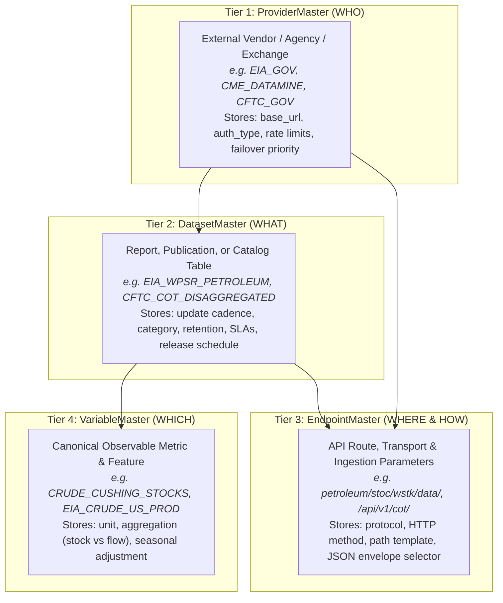

# Chapter 3: Metadata Catalog & Feature Registry Architecture

In this platform, data does not exist as isolated, mystery CSVs or ad-hoc API calls. Every measurable physical metric, futures curve point, and supply/demand fundamental is registered in the **4-Tier Metadata Catalog**.

This architecture solves the core problem of enterprise data platforms: **knowing WHO provides data, WHAT report it lives in, WHERE the API route is, and WHICH specific quantitative metric it represents.**

---

## 1. The 4-Tier Data Map



---

## 2. The 4 Catalog Modules at a Glance

| Module | Core Responsibility | Key Models & Tables |
| :--- | :--- | :--- |
| **[Provider Master](provider-master.md)** | Institutional registry of 20 benchmark data sources, 12-factor auth references, proactive rate limit budgets, and fallback failovers. | `ProviderMaster` |
| **[Dataset Master](dataset-master.md)** | Canonical catalog of 23 benchmark datasets, multi-asset commodity linkages, update cadences, ingestion modes, and release SLAs. | `DatasetMaster` |
| **[Endpoint Master](endpoint-master.md)** | Canonical registry of 26 benchmark API route templates, HTTP parameter schemas, payload envelope selectors, and URL builders. | `EndpointMaster` |
| **[Variable Master](variable-master.md)** | Standardized dictionary of 40 canonical commodity variables, stock vs. flow aggregation behaviors, and display transformation hints. | `VariableMaster` |

---

## 3. How to Add New Features to This Catalog

To add any new feature (e.g. European Gas Storage, Baltic Dry Index, Tanker Rates, Crop Progress):
- If the dataset already exists: **Only update `VariableMaster`**!
- If it is from a new vendor: Run the 10-second CLI command:
  ```powershell
  python manage.py add_feature --code=NEW_METRIC_CODE --unit=UOM --dataset=DATASET_CODE --provider=PROVIDER_CODE
  ```

> Read the full step-by-step guide:  
> **[How to Add New Features, Datasets & Variables in 2 Minutes \u2192](../guides/adding-new-feature.md)**
