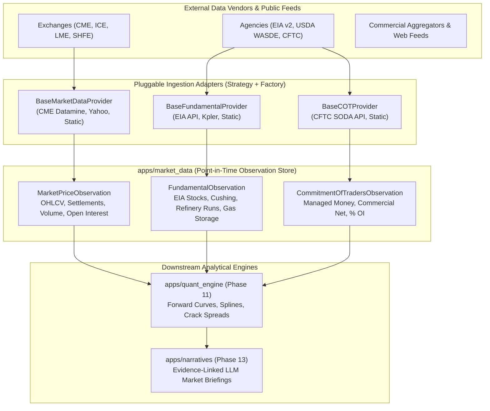

# Module Architecture: Market Data & Observation Store (`apps/market_data`)

The **Market Data & Time-Series Observation Store** is the quantitative heartbeat and central ingestion layer of the Commodity Market Intelligence Platform. It ingests, stores, and serves high-fidelity market prices, official government supply/demand fundamentals, and CFTC institutional trader positioning with strict point-in-time integrity.

---

## 1. Architectural Role & Pipeline



---

## 2. Developer Quick-Reference: How This Guarantees Easy Replacements & Feature Additions

If you or another developer pick up this platform and need to swap a data source, news provider, fundamental feed, or LLM, use this quick reference table:

| What You Want to Change | How to Do It in This Architecture | Files Touched |
| :--- | :--- | :--- |
| **Change Market Data Source**<br>*(e.g., switch from Static/Yahoo to CME Datamine, ICE, or Bloomberg)* | Implement `BaseMarketDataProvider` in `apps/market_data/providers/` and set `MARKET_DATA_PROVIDER=cme_datamine` in `.env`. | **1 adapter file**; zero database or quant logic changes. |
| **Change Fundamental Source**<br>*(e.g., switch from EIA API to Kpler, Vortexa, or USDA)* | Implement `BaseFundamentalProvider` in `apps/market_data/providers/` and set `FUNDAMENTAL_DATA_PROVIDER=kpler` in `.env`. | **1 adapter file**; observations map automatically to canonical variables. |
| **Change News / Sentiment Provider**<br>*(e.g., switch from RSS to Bloomberg News, Reuters, or AlphaVantage)* | Implement `BaseNewsProvider` in `apps/news_intel/providers/` and set `NEWS_PROVIDER=bloomberg` in `.env`. | **1 adapter file**; news articles auto-tag to commodities. |
| **Change LLM Provider**<br>*(e.g., switch from Google Gemini to Claude, OpenAI, or local Ollama)* | Implement `BaseLLMProvider` in `apps/narratives/providers/` and set `LLM_PROVIDER=claude` in `.env`. | **1 adapter file**; prompt templates and context builders remain unchanged. |
| **Add a Brand-New Feature for LLM**<br>*(e.g., Baltic Dry Index, Vessel Waiting Times, European Gas Storage)* | 1. Add variable to `VariableMaster`.<br>2. Ingest observations.<br>The Quant Engine and LLM context builder pick it up automatically! | **Zero code refactoring**. Fully extensible. |

---

## 3. Core Directives Enforced

### 1. Rule 2: Point-in-Time Correctness (Anti-Lookahead Bias)
Commodity research and quantitative backtests require absolute chronological honesty. For every observation, three distinct temporal milestones are recorded:
- `observation_date`: The physical trade date or survey cutoff date (e.g. Tuesday for CFTC COT).
- `publication_time`: The exact UTC timestamp when the data was made publicly accessible (e.g. Friday 20:30 UTC for CFTC, Wednesday 14:30 UTC for EIA).
- `ingestion_time`: System ingestion audit timestamp.

Historical queries and backtesting engines query data with `publication_time <= point_in_time_query`, preventing lookahead leakage.

### 2. Rule 5: Native SQL `NULL` for Unobserved Metrics
Unobserved metrics (such as a session with volume but no settlement, or an unreleased inventory figure) are strictly stored as SQL native `NULL` (`null=True, blank=True`).
- **Memory & Storage Efficiency**: Uses native 1-bit database null bitmaps rather than 32-byte status strings.
- **Mathematical Distinction**: Distinguishes between `0.0` (a valid real zero) and `NULL` (unobserved / pending).
- **SIMD C-Vectorization**: Exporting querysets directly to Pandas/NumPy translates native `NULL` into `np.nan`, accelerating vectorized vector calculations.
- **Presentation & LLM Layer**: The API and LLM layers automatically format `NULL` values as `"NOT_AVAILABLE"`.

---

## 4. Relational Data Models

### `MarketPriceObservation`
Captures session prices, daily settlements, volume, and open interest for physical benchmarks and individual futures contracts.

| Field | Type | Description |
| :--- | :--- | :--- |
| `id` | UUID | Primary key. |
| `commodity` | FK (`CommodityMaster`) | Canonical underlying physical commodity (e.g., `CL`, `BRENT`, `NG`). |
| `contract` | FK (`ContractSpecification`) | Specific derivative specification (optional). |
| `delivery_month` | CharField(16) | Delivery month code (e.g. `'2026-11'`, `'PROMPT'`). |
| `is_prompt` | BooleanField (indexed) | True for continuous front-month benchmark series. |
| `observation_date` | DateField (indexed) | Market pricing date. |
| `open_price` | Decimal(18, 6) | Opening price (`NULL` if unobserved). |
| `high_price` | Decimal(18, 6) | High price (`NULL` if unobserved). |
| `low_price` | Decimal(18, 6) | Low price (`NULL` if unobserved). |
| `close_price` | Decimal(18, 6) | Close price (`NULL` if unobserved). |
| `settlement_price` | Decimal(18, 6) (indexed) | Official exchange daily settlement price. |
| `volume` | BigIntegerField | Session volume. |
| `open_interest` | BigIntegerField | End-of-session open interest. |
| `quality_status` | CharField(16) | Data quality status (`VALID`, `STALE`, `SUSPECT`, etc.). |
| `source_endpoint` | FK (`EndpointMaster`) | Originating ingestion endpoint route. |
| `publication_time` | DateTimeField | UTC publication timestamp. |
| `is_preliminary` | BooleanField | Flag indicating preliminary estimate. |
| `revision_number` | PositiveIntegerField | Revision sequence (0 = initial). |

### `FundamentalObservation`
Captures weekly government storage reports, refinery utilization rates, and trade balances.

| Field | Type | Description |
| :--- | :--- | :--- |
| `id` | UUID | Primary key. |
| `variable` | FK (`VariableMaster`) | Standardized observable metric (e.g., `CRUDE_CUSHING_STOCKS`). |
| `observation_date` | DateField (indexed) | Survey reference date. |
| `value` | Decimal(20, 6) | Observed numerical value (`NULL` for unobserved). |
| `unit` | FK (`UnitMaster`) | Standardized Unit of Measure (e.g. `MBBL`, `BCF`). |
| `period_start` | DateField | Survey window start (e.g. Saturday for EIA). |
| `period_end` | DateField | Survey window end (e.g. Friday for EIA). |
| `publication_time` | DateTimeField | Official agency release time (e.g. Wednesday 14:30 UTC). |
| `source_endpoint` | FK (`EndpointMaster`) | Originating ingestion endpoint route. |
| `revision_number` | PositiveIntegerField | Revision sequence number. |

### `CommitmentOfTradersObservation`
Captures CFTC institutional trader positioning across Managed Money (Hedge Funds/CTAs) and Commercial Hedgers.

| Field / Property | Type | Description |
| :--- | :--- | :--- |
| `commodity` | FK (`CommodityMaster`) | Commodity anchor. |
| `observation_date` | DateField (indexed) | Tuesday survey cutoff date. |
| `report_type` | CharField(20) | `DISAGGREGATED`, `LEGACY`, or `FINANCIAL`. |
| `open_interest` | BigIntegerField | Total reported open interest. |
| `prod_merc_long/short` | BigIntegerField | Producer/Merchant/Processor hedging. |
| `swap_long/short` | BigIntegerField | Swap Dealers hedging and positioning. |
| `money_manager_long/short` | BigIntegerField | Managed Money / Speculative Fund positioning. |
| `money_manager_net` | Property (int) | `Long - Short` speculative net positioning. |
| `commercial_net` | Property (int) | `(Prod Long + Swap Long) - (Prod Short + Swap Short)`. |
| `money_manager_net_pct_oi`| Property (float) | Managed Money Net as a percentage of Total Open Interest. |
| `commercial_net_pct_oi` | Property (float) | Commercial Net as a percentage of Total Open Interest. |

---

## 5. Management Commands

### Batch Ingestion (`ingest_market_data`)
The management command populates time series from the active pluggable providers idempotently:

```powershell
# Ingest all domains (prices, fundamentals, COT) for default commodities (90 days history)
.\.venv\Scripts\python.exe manage.py ingest_market_data

# Ingest only prompt and curve prices for WTI Crude (CL) and Brent (BRENT)
.\.venv\Scripts\python.exe manage.py ingest_market_data --type=prices --commodity=CL,BRENT

# Ingest 120 days of CFTC positioning data
.\.venv\Scripts\python.exe manage.py ingest_market_data --type=cot --days=120

# Reset and re-seed observations cleanly
.\.venv\Scripts\python.exe manage.py ingest_market_data --clear
```
