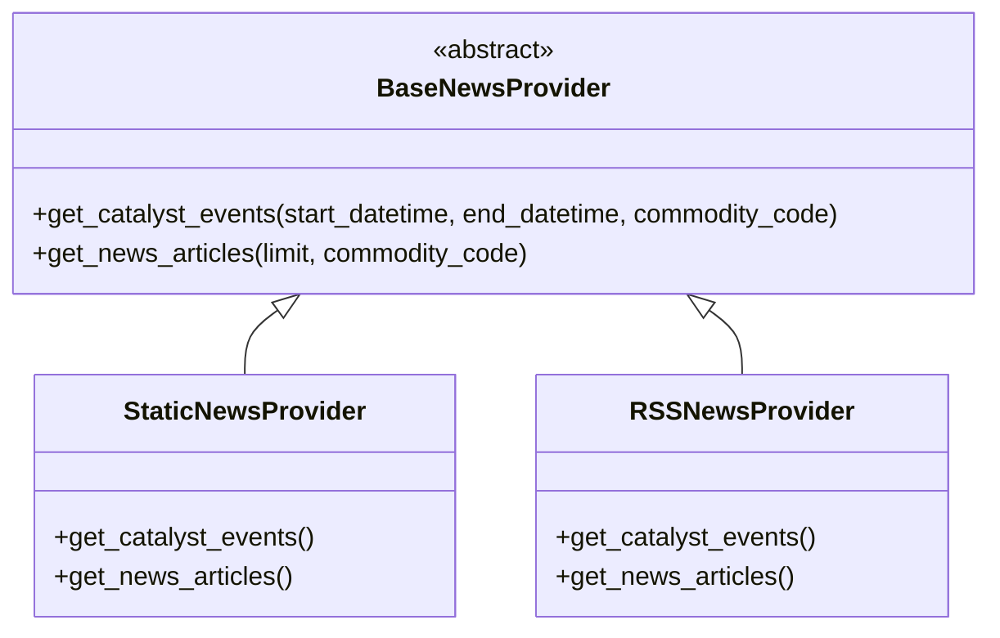

# News, Sentiment & Macro Catalyst Calendar (`apps/news_intel`)

The **News, Sentiment & Macro Catalyst Calendar** module provides real-time news intelligence, deterministic financial sentiment analysis, and a macroeconomic catalyst event calendar tracking scheduled institutional releases (OPEC+, WASDE, FOMC, EIA) with automated point-in-time consensus surprise calculations.

---

## 1. Architectural Philosophy & Core Directives

1. **Multi-Commodity Impact Linkage**:
   A single macroeconomic announcement or geopolitical wire headline frequently impacts multiple physical commodities simultaneously, often with different directions and intensities. For example, OPEC+ voluntary production cuts are bullish for WTI (`CL`) and Brent (`BRENT`), bullish for Middle East heating oil (`HO`), but compress crack spreads (`RB`) and alter the Brazilian sugar-to-ethanol parity (`SUGAR_11`). The `NewsCommodityTag` through-model establishes explicit many-to-many linkages with per-commodity relevance scores and directional sentiment polarities.

2. **Point-in-Time Correctness & Zero Lookahead Bias**:
   All `MarketCatalystEvent` and `NewsArticle` instances inherit from `PointInTimeModel`, preserving exact scheduled UTC announcement times, release publication timestamps, and observation availability timestamps.

3. **Deterministic Sentiment & Surprise Arithmetic**:
   Before any LLM reasoning takes place, sentiment polarity $(-1.000 \text{ to } +1.000)$ and consensus surprise deltas ($\text{Actual} - \text{Consensus}$) are evaluated deterministically using specialized financial lexicons and economic domain mechanics.

4. **100% Air-Gapped Test Isolation**:
   Testing relies exclusively on `StaticNewsProvider`, ensuring zero brittle network requests or rate limits during automated CI/CD runs.

---

## 2. Core Domain Models

### `MarketCatalystEvent`
Tracks scheduled and occurred macroeconomic, government, and industry releases.

| Field | Type | Description |
| :--- | :--- | :--- |
| `name` | `CharField(200)` | Official release title (e.g. "USDA WASDE", "EIA Crude Stocks") |
| `event_type` | `CharField(32)` | Enum: `POLICY_OPEC`, `GOVERNMENT_WASDE`, `MACRO_CENTRAL_BANK`, `INVENTORY_EIA`, `REGULATORY_CFTC`, `WEATHER_ANOMALY` |
| `impact_level` | `CharField(16)` | Market volatility intensity: `HIGH`, `MEDIUM`, `LOW` |
| `scheduled_datetime_utc` | `DateTimeField` | Exact scheduled announcement timestamp in UTC |
| `status` | `CharField(16)` | `SCHEDULED`, `OCCURRED`, `POSTPONED`, `CANCELLED` |
| `primary_commodity` | `ForeignKey(CommodityMaster)` | Benchmark commodity most directly impacted |
| `affected_commodities` | `ManyToManyField(CommodityMaster)` | All cross-asset commodities influenced by the release |
| `source_agency` | `CharField(100)` | Issuing organization (e.g. "OPEC Secretariat", "USDA WAOB", "EIA") |
| `period_covered` | `CharField(64)` | Reporting reference window (e.g. "Week Ended Sep 25, 2026") |
| `consensus_expectation` | `DecimalField(18, 4)` | Survey median consensus expectation prior to print |
| `actual_value` | `DecimalField(18, 4)` | Officially published actual figure |
| `prior_value` | `DecimalField(18, 4)` | Prior period figure |
| `unit` | `ForeignKey(UnitMaster)` | Standardized measurement unit (`MMBBL`, `BCF`, `PERCENT`, etc.) |
| `surprise_magnitude` | `DecimalField(18, 4)` | Delta: $\text{Actual} - \text{Consensus}$ |
| `surprise_direction` | `CharField(24)` | `BULLISH_SURPRISE`, `BEARISH_SURPRISE`, `IN_LINE`, `UNAVAILABLE` |

### `NewsArticle`
Captures ingested news headlines and wire dispatches with SHA-256 content deduplication.

| Field | Type | Description |
| :--- | :--- | :--- |
| `title` | `CharField(300)` | Wire headline |
| `summary` | `TextField` | Concise executive summary or introductory excerpt |
| `source_name` | `CharField(100)` | Originating publisher (e.g. "Reuters", "Bloomberg", "Argus") |
| `published_at_utc` | `DateTimeField` | Official publication timestamp in UTC |
| `content_hash` | `CharField(64)` | Unique SHA-256 hash of `title + published_at_utc` |
| `overall_sentiment_score` | `DecimalField(5, 3)` | Normalized polarity score ($-1.000$ to $+1.000$) |
| `overall_sentiment_label` | `CharField(24)` | `STRONG_BULLISH`, `MODERATE_BULLISH`, `NEUTRAL`, `MODERATE_BEARISH`, `STRONG_BEARISH` |
| `confidence_score` | `DecimalField(5, 3)` | Classification confidence probability ($0.0$ to $1.0$) |
| `is_breaking` | `BooleanField` | High-urgency breaking news flag |
| `primary_commodity` | `ForeignKey(CommodityMaster)` | Highest-weighted primary commodity |
| `catalyst_event` | `ForeignKey(MarketCatalystEvent)` | Associated scheduled catalyst if reporting on an official print |

### `NewsCommodityTag` (Through Model)
Establishes granular many-to-many linkages between articles and multiple commodities.

| Field | Type | Description |
| :--- | :--- | :--- |
| `article` | `ForeignKey(NewsArticle)` | Target news article |
| `commodity` | `ForeignKey(CommodityMaster)` | Affected physical commodity |
| `relevance_score` | `DecimalField(5, 3)` | Relevance weight ($0.000$ to $1.000$) |
| `is_primary` | `BooleanField` | True if this commodity is the primary subject |
| `commodity_sentiment` | `CharField(24)` | Sentiment label specific to this individual asset |
| `commodity_sentiment_score` | `DecimalField(5, 3)` | Polarity score specific to this commodity |
| `matched_keywords` | `JSONField` | Physical taxonomy keywords and stems that triggered match |

---

## 3. Core Intelligence Services

### 1. `CommodityEntityLinker`
Maps raw headline and article text to canonical commodities using an institutional domain taxonomy and cross-commodity relationship rules:
- **Direct Matching**: Scans for primary physical terms (e.g., "crude oil", "wti", "cushing" for `CL`; "henry hub", "lng" for `NG`) and secondary terms.
- **Cross-Commodity Propagation**: Applies domain transmission rules:
  - `CL` matches propagate to `BRENT` (0.85), `HO` (0.65), `RB` (0.65).
  - `CORN` matches propagate to `SOYBEANS` (0.65), `SUGAR_11` (0.35 ethanol link).
  - Central Bank rate cuts propagate to `GOLD` (0.85), `SILVER` (0.85), `COPPER` (0.45).

### 2. `LexiconSentimentEngine`
Deterministic, zero-latency sentiment engine using Loughran-McDonald style financial lexicons optimized for physical commodity markets:
- Evaluates bullish terms (`cut`, `drawdown`, `deficit`, `tightening`, `drought`, `rally`, `surge`, `stimulus`) and bearish terms (`build`, `glut`, `surplus`, `bumper`, `slump`, `recession`, `oversupply`).
- Features a 3-word preceding negation window (`not`, `unlikely`, `failed to`, `despite`).
- Computes overall polarity score in $[-1.000, +1.000]$ and derives individual commodity scores proportional to entity relevance.

### 3. `CatalystSurpriseEngine`
Evaluates consensus expectation vs. actual reported figures:
- $\Delta = \text{Actual} - \text{Consensus}$.
- Applies domain-specific directional rules:
  - **Inventories (`INVENTORY_EIA`)**: Lower actual than consensus (negative delta) is `BULLISH_SURPRISE`. Larger build is `BEARISH_SURPRISE`.
  - **Crop Supply (`GOVERNMENT_WASDE`)**: Lower yield/production than consensus is `BULLISH_SURPRISE`.
  - **Central Bank (`MACRO_CENTRAL_BANK`)**: Lower rates than consensus is `BULLISH_SURPRISE` for physical bullion and commodities.

---

## 4. Pluggable Provider Architecture



- **`StaticNewsProvider`**: Benchmark calendar of OPEC, WASDE, FOMC, and EIA releases, plus multi-commodity articles linking energy, agriculture, and metals.
- **`RSSNewsProvider`**: Ingests live XML/RSS feeds from governmental agencies with automatic fallback to static data.
- **`get_news_provider()`**: Factory configured via `NEWS_PROVIDER` setting (`"static"` or `"rss"`).

---

## 5. Management Command

```powershell
# Ingest all catalysts, articles, and multi-commodity tags
.\.venv\Scripts\python.exe manage.py ingest_news_intel --clear

# Filter by type or choose a specific provider
.\.venv\Scripts\python.exe manage.py ingest_news_intel --provider=rss --type=articles
```
