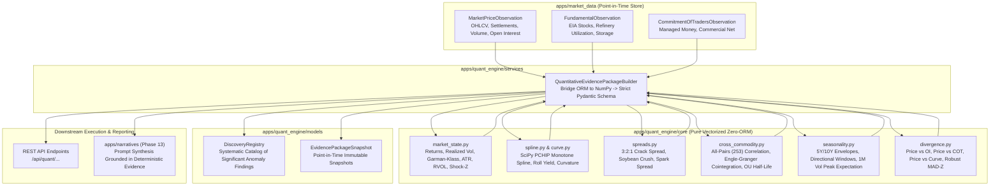
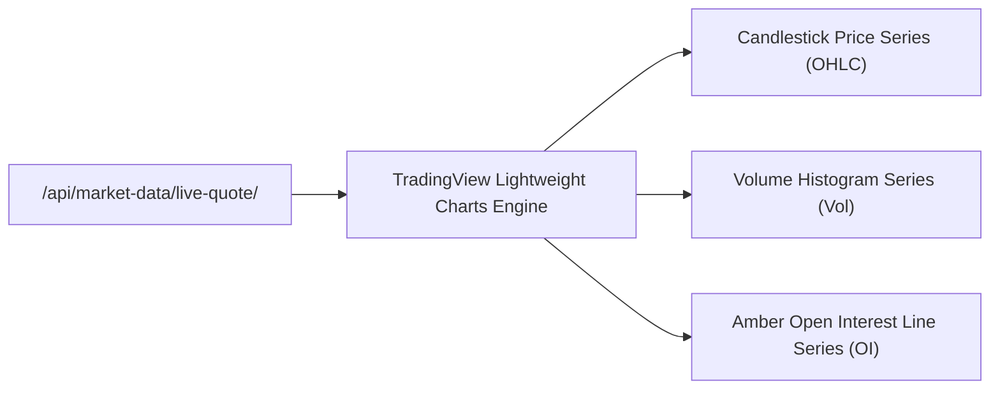

# Module Architecture: Quantitative Research & Forward Curves Engine (`apps/quant_engine`)

The **Quantitative Research & Forward Curves Engine** is the deterministic analytical core of the Commodity Market Intelligence Platform. It sits directly between the raw point-in-time observation store (`apps/market_data`) and the LLM narrative synthesis layer (`apps/narratives`).

In strict alignment with the platform's **Deterministic Math Directive**, this module performs all multi-horizon volatility, forward curve spline interpolation, crack/crush spread modeling, cross-commodity cointegration, macro sensitivity tracking, and seasonality pattern recognition using pure vectorized NumPy and SciPy routines before any language model is invoked.

---

## 1. Architectural Pipeline & Data Flow



---

## 2. Core Mathematical Principles & Design Directives

### 1. Vectorized Zero-ORM Architecture
All statistical and mathematical calculations inside `apps/quant_engine/core/` are decoupled from Django models and database queries. Core functions take pure `numpy.ndarray` arrays and scalar floats:
- **Sub-Millisecond Speed**: Vectorized linear algebra and spline evaluations execute in `< 1.5 ms`.
- **Source Independence**: Core mathematical routines can be unit-tested without a database or swapped into standalone Celery/Ray compute workers.
- **Robust Numerical Stability**: Zero third-party C-extension fragility. Cointegration Engle-Granger tests use pure NumPy linear algebra OLS regressions and augmented Dickey-Fuller (ADF) Dickey-Fuller critical tau polynomial expansions.

### 2. Zero LLM Mental Math
Language models are notorious for arithmetic drift, hallucinated percentages, and inability to calculate log returns or monotone spline derivatives.
- The Quant Engine computes every metric (returns, annualized volatility, crack spreads, roll yields, ADF $t$-statistics, $p$-values, half-lives, seasonal win rates) deterministically.
- Downstream narrative models receive a fully populated and validated Pydantic v2 `QuantitativeEvidencePackage` containing structured, immutable numeric values.

### 3. Point-in-Time Historical Honesty
When building an evidence package for a given `as_of_date`:
- Market prices, inventory levels, and COT positioning are strictly filtered by `publication_time <= point_in_time_query`.
- Forward curves only ingest contract settlements that traded on or prior to the evaluation date, preventing future lookahead leakage into backtests or LLM briefings.

---

## 3. Core Engine Components

### A. Market State & Volatility (`market_state.py`)
Calculates high-fidelity volatility and liquidity metrics across multiple lookback windows:
* **Log Returns**: $r_t = \ln(P_t / P_{t-1})$ evaluated across 1D, 5D, 21D (1M), 63D (3M), and 252D (1Y).
* **Close-to-Close Realized Volatility**: Annualized historical volatility:
  $$\sigma_{realized} = \sqrt{252 \times \frac{1}{N-1} \sum_{i=1}^{N} (r_i - \bar{r})^2}$$
* **Garman-Klass Extreme-Value Volatility**: Ingests intraday High, Low, Open, and Close to reduce variance by ~8x relative to close-to-close estimators:
  $$\sigma_{GK}^2 = \frac{252}{N} \sum_{i=1}^{N} \left[ 0.5 \left(\ln \frac{H_i}{L_i}\right)^2 - (2\ln 2 - 1) \left(\ln \frac{C_i}{O_i}\right)^2 \right]$$
* **Parkinson High-Low Volatility**: Continuous Brownian-motion based dispersion.
* **Average True Range (ATR)**: 14-period Wilder standard measuring price range expansion.
* **Volume Metrics**:
  - Relative Volume (RVOL): $\text{RVOL} = \text{Volume}_t / \overline{\text{Volume}}_{20D}$.
  - Volume Shock Z-Score: Standardized deviation of log volume relative to historical mean.
* **Open Interest (OI) Regime**: Identifies structural positioning flows:
  - `ACCUMULATION`: Price $\uparrow$, Open Interest $\uparrow$ (Aggressive long buying).
  - `SHORT_BUILD`: Price $\downarrow$, Open Interest $\uparrow$ (Aggressive short initiation).
  - `LIQUIDATION`: Price $\downarrow$, Open Interest $\downarrow$ (Longs exiting positions).
  - `SHORT_COVERING`: Price $\uparrow$, Open Interest $\downarrow$ (Shorts forced to buy to cover).

---

### B. Forward Curves & Monotone Splines (`spline.py` & `curve.py`)
Commodity futures term structures often exhibit localized supply stress (backwardation) or storage gluts (contango). Standard cubic splines introduce artificial oscillations (Runge phenomenon).
* **PCHIP Monotone Hermite Splines**: Uses SciPy's Piecewise Cubic Hermite Interpolating Polynomial (`scipy.interpolate.PchipInterpolator`) to preserve shape monotonicity between discrete contract maturities.
* **Term Structure Sampling**: Interpolates daily points from Day 0 (Spot) through Month 24, providing continuous forward curves for any maturity.
* **Roll Yield & Annualized Slope**:
  $$\text{Roll Yield}_{1Y} = \frac{P_{M1} - P_{M12}}{P_{M1}} \times 100\%$$
* **Curvature (Butterfly Spread)**: $2 \times P_{M2} - (P_{M1} + P_{M3})$, quantifying kinks in prompt physical delivery.

---

### C. Physical Processing Spreads (`spreads.py`)
Computes real-time refining and processing margins with automated volumetric unit conversions:

| Processing Complex | Formula | Units | Physical Interpretation |
| :--- | :--- | :--- | :--- |
| **Refinery 3:2:1 Crack Spread** | $\frac{2 \times P_{\text{RBOB}} \times 42 + 1 \times P_{\text{HO}} \times 42 - 3 \times P_{\text{WTI}}}{3}$ | \$/barrel | Economic incentive for refineries to process light sweet crude into gasoline and distillates. |
| **Soybean Crush Margin** | $(P_{\text{Meal}} \times 0.022) + (P_{\text{Oil}} \times 0.11) - P_{\text{Beans}}$ | \$/bushel | Economic profitability of crushing raw soybeans into soybean meal (protein feed) and soybean oil (food/biodiesel). |
| **Natural Gas Spark Spread** | $P_{\text{Power}} - (\text{Heat Rate} \times P_{\text{NG}})$ | \$/MWh | Margin earned by gas-fired power plants burning natural gas to generate electricity. |

---

### D. Cross-Commodity & Macro Sensitivity Engine (`cross_commodity.py`)

#### 1. All-Pairs Correlation & Cointegration
- Computes pairwise return correlation matrix across all 253 commodity pairs ($N \times (N-1) / 2$).
- **Engle-Granger Two-Step Cointegration**:
  1. OLS regression of $Y_t$ on $X_t$ to establish dynamic hedge ratio $\beta$:
     $$Y_t = \alpha + \beta X_t + \epsilon_t$$
  2. Augmented Dickey-Fuller (ADF) unit root test on residuals $\epsilon_t$ to verify stationarity ($I(0)$).
  3. Continuous Ornstein-Uhlenbeck (OU) mean-reversion modeling to compute equilibrium half-life in days:
     $$\Delta \epsilon_t = \theta (\mu - \epsilon_{t-1}) \Delta t + \sigma dW_t \implies \text{Half-Life} = \frac{\ln 2}{\theta}$$
  4. Residual Z-score: Standardized deviation of current spread from equilibrium mean, highlighting statistical arbitrage opportunities.

#### 2. Curated Logical Commodity Complexes
To complement brute-force all-pairs statistical search, the engine maintains 8 curated physical/economic complexes with explicit structural rationales:

| Complex Code | Logical Name | Commodities | Economic / Physical Relationship Rationale |
| :--- | :--- | :--- | :--- |
| `REFINERY_ENERGY` | Refinery Energy Complex | WTI, Brent, RBOB Gasoline, Heating Oil, Gasoil | Direct physical refining inputs and output products. High cointegration governed by cracking margins and crude runs. |
| `OILSEED_CRUSH` | Oilseed Crush Complex | Soybeans, Soybean Oil, Soybean Meal | Structural input-output processing relationship. Cointegration maintained by soybean crush plants and feed demand. |
| `BIOFUEL_SUGAR` | Biofuel & Sugar Feedstock Complex | Sugar #11, Ethanol, WTI Crude Oil | Brazilian flex-fuel vehicle fleet creates structural parity: Mills toggle between cane-for-sugar and cane-for-ethanol based on crude parity. |
| `GRAIN_FEED` | Feedgrain & Starch Complex | Corn, Chicago Wheat, Kansas Wheat | Direct substitutability in livestock feed rations and shared midwestern growing acres. |
| `LIVESTOCK_FEEDING` | Livestock Feeding Complex | Live Cattle, Feeder Cattle, Corn | Feedlot economics: Corn is the primary input cost to fatten feeder cattle into market-ready live cattle. |
| `POWER_SPARK` | Natural Gas & Power Generation | Natural Gas, Electricity | Natural gas is the marginal fuel source for peak power generation via combined-cycle turbines. |
| `PRECIOUS_MONETARY` | Precious Monetary Complex | Gold, Silver, Platinum | Monetary metals with store-of-value dynamics, real interest rate sensitivity, and central bank reserve allocations. |
| `BASE_METALS` | Base Industrial Metals | Copper, Aluminum, Zinc, Nickel | Global macroeconomic, construction, and green energy transition industrial barometers. |

#### 3. Macro Factor Sensitivities
Tracks direct correlation and sensitivity between physical commodities and exogenous macro drivers:
- **US Dollar Index (DXY)**: Inversely correlated with dollar-denominated globally traded commodities.
- **US 10-Year Real Yields**: Primary opportunity-cost driver for non-yielding store-of-value assets (Gold, Silver).
- **WTI Crude Oil**: Macro energy bellwether driving transportation and chemical input costs for agricultural softs (Sugar, Corn).

---

### E. Seasonality & Directional Pattern Recognition (`seasonality.py`)
Agricultural and energy commodities follow distinct seasonal patterns driven by crop planting/harvest schedules, summer driving demand, and winter heating inventory drawdowns:
* **Day-of-Year 5Y & 10Y Envelopes**: Computes normalized seasonal trajectories with median, 10th percentile, and 90th percentile bounds.
* **Directional Tenure Windows**: Evaluates 10-day, 30-day, and 63-day historical forward performance over the past 5 to 10 years:
  - Historical win rate (% of years with positive forward return over window).
  - Student's $t$-statistic and directional move conviction score.
* **Forward 1-Month Volatility Peak Expectation**: Pinpoints historical calendar months with recurring volatility expansion (e.g. August Midwest weather market for corn/soybeans).
* **Physical Commodity Lifecycle Integration**: Encodes official agronomic and consumption cycles:
  - `CORN`: US planting (Apr-May), pollination window (Jul), harvest pressure (Sep-Nov).
  - `WTI`: Refinery spring maintenance (Mar-Apr), summer driving peak (Jun-Aug), winter diesel build (Oct-Nov).
  - `NG`: Shoulder injection season (Apr-Oct), peak heating withdrawal (Dec-Feb).

---

### F. Multi-Dimensional Divergence Detection (`divergence.py`)
Detects quantitative anomalies where price action conflicts with institutional positioning or fundamental indicators:
- **Price vs Open Interest**: Price making 20-day new highs on deteriorating open interest signals exhaustion / short-squeeze ending.
- **Price vs Commercial COT**: Price reaching multi-month highs while commercial hedgers hold near-record net short positions indicates institutional distribution into retail buying.
- **Price vs Forward Curve**: Spot price rallying while front-month calendar spreads collapse into contango signals prompt physical oversupply.
- **Robust Outlier Scoring**: Utilizes Median Absolute Deviation (MAD-Z):
  $$\text{MAD-Z} = \frac{0.6745 \times (x_i - \text{median}(X))}{\text{median}(|x_i - \text{median}(X)|)}$$
  Ensures resilience against extreme black-swan outliers.

---

## 4. Intermediate Evidence Schema (`QuantitativeEvidencePackage`)

The ultimate deliverable of `apps/quant_engine` is a strictly-typed Pydantic v2 `QuantitativeEvidencePackage` matching Section 5.12 of the Master Architecture PDF.

```json
{
  "commodity_code": "CL",
  "as_of_date": "2026-09-24",
  "market_state": {
    "settlement_price": 75.85,
    "returns_1d": 0.0125,
    "returns_5d": -0.0084,
    "returns_21d": 0.0412,
    "returns_63d": 0.0789,
    "realized_vol_21d": 0.2450,
    "realized_vol_63d": 0.2280,
    "garman_klass_vol_21d": 0.2310,
    "atr_14": 1.65,
    "rvol_20d": 1.34,
    "volume_shock_zscore": 1.82,
    "oi_regime": "ACCUMULATION"
  },
  "forward_curve": {
    "prompt_spread_m1_m2": 0.45,
    "roll_yield_1y_pct": 5.82,
    "term_structure_slope": "BACKWARDATION",
    "butterfly_curvature": -0.12,
    "interpolated_nodes": [
      {"month": 0, "days": 0, "price": 75.85},
      {"month": 1, "days": 30, "price": 75.40},
      {"month": 12, "days": 365, "price": 71.43}
    ]
  },
  "spreads": {
    "crack_321": 24.50,
    "crush_margin": null,
    "spark_spread": null
  },
  "cross_commodity": {
    "logical_complex": "REFINERY_ENERGY",
    "logical_complex_name": "Refinery Energy Complex",
    "economic_rationale": "Direct physical refining inputs and output products. High cointegration governed by cracking margins and crude runs.",
    "cointegration_pairs": [
      {
        "pair": "CL-XB",
        "hedge_ratio_beta": 0.84,
        "adf_t_statistic": -3.85,
        "p_value": 0.0024,
        "is_cointegrated": true,
        "half_life_days": 4.2,
        "residual_zscore": -1.45
      }
    ],
    "macro_factor_sensitivities": {
      "US_DOLLAR_INDEX": -0.68,
      "CRUDE_OIL_WTI": 1.00
    }
  },
  "seasonality": {
    "directional_patterns": [
      {
        "tenure_days": 30,
        "direction": "BULLISH",
        "historical_win_rate": 0.80,
        "mean_return": 0.042,
        "t_statistic": 2.65,
        "significance": "HIGH"
      }
    ],
    "forward_vol_peak": {
      "historical_peak_month": 10,
      "peak_month_name": "October",
      "expected_vol_ratio": 1.25,
      "narrative": "Historical volatility expands into October due to heating oil inventory repositioning and shoulder season refinery maintenance."
    }
  },
  "divergences": [
    {
      "type": "PRICE_OI_DIVERGENCE",
      "severity": "MODERATE",
      "description": "Price pushing new 20-day high with open interest declining (potential short covering exhaustion)."
    }
  ]
}
```

---

## 5. Persistence Models (`apps/quant_engine/models.py`)

### `DiscoveryRegistry`
An auditable discovery catalog that logs statistically significant anomalies, cointegration breaks, and regime transitions.
* `discovery_type`: `COINTEGRATION_BREAK`, `SEASONAL_ANOMALY`, `OI_DIVERGENCE`, `SPREAD_EXTREME`, `CURVE_INVERSION`.
* `commodity`: Related commodity foreign key.
* `metrics`: JSON dictionary storing exact $z$-scores, $p$-values, and beta ratios.
* `is_active`: Flag indicating whether the anomaly currently persists.

### `EvidencePackageSnapshot`
Immutable point-in-time snapshot of the generated `QuantitativeEvidencePackage`. Ensures historical research queries, audit trails, and narrative briefings can be reproduced verbatim.

---

## 6. 40-Method Institutional Seasonality Taxonomy & Matrix

The Commodity Market Intelligence platform features an institutional 40-method seasonality evaluation matrix covering 14 analytical lenses, calculated deterministically via `evaluate_40_seasonality_methods()` without external black-box libraries.

| # | Section | Method Name | Why It Matters | Formula / Metric Summary |
|---|---------|-------------|----------------|--------------------------|
| 1 | **Calendar** | Month-of-year seasonality | Captures annual seasonal cycles across the 12 calendar months | $R_m = \frac{P_{last,m} - P_{first,m}}{P_{first,m}}$ across 2005–2026 |
| 2 | **Calendar** | Day-of-week seasonality | Captures weekly inventory effects & Monday/Friday positioning | $R_{dow} = \text{mean}(\ln(P_t / P_{t-1}))$ by weekday |
| 3 | **Calendar** | Day-of-year seasonality | Granular daily path benchmark normalized to Jan 1 | Continuous 365-day trajectory indexed to 100 |
| 4 | **Price/Return** | Seasonal average + median return | Directional tendency robust against historical outliers | Median vs Mean monthly returns |
| 5 | **Price/Return** | Seasonal return distribution / percentiles | Captures both typical drift and tail-risk dispersion | 10th, 25th, 50th, 75th, 90th empirical percentiles |
| 6 | **Price/Return** | Positive-return probability | Measures historical consistency of seasonal direction | $\text{Win Rate} = \frac{\text{Years with } R_m > 0}{\text{Total Years}} \times 100\%$ |
| 7 | **Volatility** | Realized-volatility seasonality | Identifies periods of volatility expansion and contraction | Forward 30-day annualized realized volatility baseline |
| 8 | **Volatility** | Range / ATR seasonality | Forecasts expected trading range relative to annual norm | $\text{Range Ratio} = \frac{\text{Current 21D Median Range}}{\text{Annual ATR}}$ |
| 9 | **Intraday** | Hour-of-day seasonality | Identifies recurring intraday volume and volatility clusters | European/US open volume distribution |
| 10 | **Intraday** | Session seasonality | Separates Asian, European, and US contribution to daily moves | Session percentage return contribution |
| 11 | **Volume/Liquidity** | Volume seasonality | Detects seasonal participation and contract roll surges | Quarterly average daily volume vs annual baseline |
| 12 | **Volume/Liquidity** | Relative-volume seasonality | Normalizes volume against historical seasonal benchmarks | $\text{RVOL} = \frac{\text{Volume}_t}{\text{Seasonal Benchmark}}$ |
| 13 | **Futures Curve** | Calendar-spread seasonality | Tracks prompt-to-deferred spread changes into delivery | $S_{1,2} = P_{M1} - P_{M2}$ delivery month behavior |
| 14 | **Futures Curve** | Curve-shape / contango-backwardation | Identifies structural convenience yield shifts | Annualized term structure slope: $\frac{P_{M12} - P_{M1}}{P_{M1}}$ |
| 15 | **Futures Curve** | Roll-yield seasonality | Measures predictable carry from rolling futures contracts | $\text{Roll Yield} = \frac{P_{spot} - P_F}{P_{spot}} \times \frac{12}{T}$ |
| 16 | **Fundamentals** | Inventory seasonality | Benchmarks physical storage cycles against 5-year averages | Deviation from 5Y average inventory injection/draw |
| 17 | **Fundamentals** | Production/consumption seasonality | Reflects physical planting, harvest, and refining throughput | Balance sheet quarterly flow equilibrium |
| 18 | **Fundamentals** | Import/export seasonality | Captures recurring global trade flows and port terminal peaks | Seasonal trade balance flow indices |
| 19 | **Fundamentals** | Weather seasonality | Quantifies weather anomalies (cooling/heating degree days) | CDD/HDD seasonal deviations vs climatological normals |
| 20 | **Events** | Scheduled-report seasonality | Measures price shocks around EIA, WASDE, and USDA releases | 1-day absolute return multiplier on report days |
| 21 | **Events** | Expiration/roll seasonality | Captures index roll windows (e.g. Goldman Roll 5th-9th BD) | Liquidity compression around monthly contract expiry |
| 22 | **Statistical** | Seasonal z-score | Quantifies how unusual current prices are vs seasonal norm | $Z = \frac{P_t - \mu_{\text{seasonal}}}{\sigma_{\text{seasonal}}}$ |
| 23 | **Statistical** | Seasonal percentile | Non-parametric rank of current price vs historical dates | Empirical percentile rank [0–100] |
| 24 | **Statistical** | Seasonal decomposition | Isolates seasonal cyclicity from secular macro trend | Additive STL decomposition: $Y_t = T_t + S_t + I_t$ |
| 25 | **Statistical** | Autocorrelation-based seasonality | Detects recurring periodic memory and cyclicity | $\rho_k = \text{Corr}(R_t, R_{t-k})$ at lags 5, 21, 63, 126, 252 |
| 26 | **Dynamic** | Rolling seasonality | Detects structural drift in seasonal timing over decades | 5Y rolling path vs 20Y secular benchmark |
| 27 | **Dynamic** | Seasonal stability/strength | Quantifies whether seasonal pattern is durable or decaying | Pearson $r$ correlation between 5Y and 20Y path |
| 28 | **Regime** | Volatility-regime conditioned | Tests if seasonal drift alters under high vs low volatility | Conditional win rate: $P(R > 0 \mid \sigma > \text{median})$ |
| 29 | **Regime** | Trend-regime conditioned | Tests performance when market is above/below 200-day MA | Trend-aligned seasonal win rate & expectancy |
| 30 | **Regime** | Fundamental-regime conditioned | Tests seasonal efficacy during inventory deficit regimes | Deficit-conditioned holding returns |
| 31 | **Cross-market** | Inter-commodity spread seasonality | Captures refinery margins (Crack, Crush, Spark) | Seasonal cointegrated transformation margins |
| 32 | **Cross-market** | Cross-asset seasonality | Captures macro transmission with DXY, rates, and equities | Rolling 60-day cross-asset correlation sensitivities |
| 33 | **Trading** | Seasonal strategy backtest | Converts seasonal hypothesis into systematic entry/exit | In-sample mechanical simulation across 2005–2026 |
| 34 | **Trading** | Seasonal expectancy / profit factor | Evaluates economic viability of seasonal holding windows | $\text{Profit Factor} = \frac{\sum \text{Wins}}{\lvert \sum \text{Losses} \rvert}$ |
| 35 | **Trading** | Seasonal drawdown analysis | Evaluates adverse excursion risk during seasonal trades | Maximum peak-to-trough drop inside holding window |
| 36 | **Trading** | Walk-forward / out-of-sample | Tests survival of seasonal edge outside training period | In-sample (2005–2018) vs Out-of-Sample (2019–2026) |
| 37 | **Visualization** | Seasonal heatmap | Two-dimensional matrix of Year $\times$ Month returns | Interactive color-coded grid with win-rate statistics |
| 38 | **Visualization** | Normalized-price/return chart | Continuous multi-year trajectory benchmarked to Jan 1 | Vectorized SVG multi-line overlay |
| 39 | **Visualization** | Percentile-band chart | Empirical confidence envelope around median path | 25th–75th interquartile & 10th–90th extreme bands |
| 40 | **Visualization** | Current-vs-seasonal comparison | Direct visual comparison of current year against history | Glowing neon real-time trajectory vs amber benchmark |

### 6.1 Interactive Seasonality Method Workbench & Visualization Engine

Rather than displaying a static catalog, the platform provides a live **Interactive Seasonality Method Workbench** mounted directly inside the 20-Year Seasonality Studio:

1. **Method Selector & Steppers**: A quick-select dropdown categorized by all 14 analytical lenses alongside `[◀ Prev]` and `[Next ▶]` stepper buttons, allowing instant switching between all 40 methods with keyboard navigation support (ArrowLeft / ArrowRight).
2. **Dynamic Vector SVG Canvas**: Renders specialized charts tailored to the mathematical structure of each method:
   - **Single & Grouped Bar Charts**: Monthly average returns, Day-of-week returns, RVOL, volume surges, and Z-scores.
   - **Multi-Line & Spline Paths**: Day-of-Year (DOY) trajectories, rolling stability indices, term-structure slopes, and event study windows.
   - **Range & Percentile Envelopes**: 5-Year historical inventory ranges with current year overlays, 10th–90th percentile dispersion funnels, and ATR envelopes.
   - **Correlograms**: Autocorrelation lags with 95% Bartlett confidence threshold lines ($p < 0.05$).
   - **Equity & Drawdown Curves**: Systematic seasonal backtest cumulative equity curves and underwater drawdown envelopes.
3. **Summary KPI Metric Tiles**: Point-in-time calculated parameters and significance metrics (win rate %, expectancy, stability coefficient, sample size).
4. **Empirical Data Table**: Tabular breakdown showing the exact mathematical numbers backing the visual chart.
5. **Institutional Takeaway**: Explanatory quantitative narrative detailing how institutional desks trade, hedge, or manage risk around the seasonal signal.
6. **Bidirectional Grid Synchronization**: Clicking any method card in the 40-card matrix automatically synchronizes the workbench, highlights the card with glowing neon accents, and scrolls the workbench into view.

### 6.2 Institutional 5-Module Terminal Command Deck

The quantitative research interface is structured as an institutional **Terminal Command Deck** designed for multi-screen trading and research environments:

```
+-----------------------------------------------------------------------------------+
|  [ 📑 Full Deck ]  [ 🗂️ Single Tab Focus ]   |   [1] Seasonality  [2] Volatility  ... |
+-----------------------------------------------------------------------------------+
|  MODULE 1: 20-Year Seasonality Studio & 40-Method Matrix                          |
|    +-- 1.1 Seasonality Overview & Win-Rate Trajectory                             |
|    +-- 1.2 20-Year Monthly Return Matrix Heatmap                                  |
|    +-- 1.3 40-Method Quantitative Explorer (with Encapsulated Lens Filter Deck)   |
|    +-- 1.4 40-Method Institutional Catalog Grid                                   |
+-----------------------------------------------------------------------------------+
|  MODULE 2: Multi-Horizon Volatility & Risk HUD                                    |
+-----------------------------------------------------------------------------------+
|  MODULE 3: Forward Curves & Spline Term Structure                                 |
+-----------------------------------------------------------------------------------+
|  MODULE 4: Inter-Commodity Spreads & Refining Margins                             |
+-----------------------------------------------------------------------------------+
|  MODULE 5: Cross-Commodity Correlation & Cointegration Matrix                     |
+-----------------------------------------------------------------------------------+
```

#### Dual Presentation Modes
1. **Full Deck Mode (`deck`)**: Renders all 5 master analytical modules in a continuous vertical command scroll. Clicking any navigation tab automatically performs smooth scrolling to the target module header while highlighting the active tab.
2. **Single Tab Focus Mode (`tabs`)**: Isolates the active module exclusively, hiding background modules to maximize viewport utilization and eliminate visual clutter during deep quantitative analysis.

#### Modular Framing & Sub-Module Isolation
Each analytical module is visually separated with distinct institutional badge headers (`MODULE X.Y`), container boundaries, and dedicated toolbars:
- **Module 1.1**: *20-Year Seasonality Overview & Win-Rate Trajectory* — displays continuous multi-year benchmark paths, monthly win-rate bars, and annual expectancy statistics.
- **Module 1.2**: *20-Year Monthly Return Matrix Heatmap* — visualizes historical percentage returns across all months (Jan–Dec) from 2005 to 2026, color-coded by magnitude and sign.
- **Module 1.3**: *40-Method Quantitative Method Explorer* — houses the interactive SVG canvas, KPI metrics, dynamic parameter sliders, and the **Encapsulated Lens Filter Deck** (with category pills, real-time keyword search, and live method counter `Filtered: N / 40 methods`) situated directly above the algorithm selector to clearly establish filter scope.
- **Module 1.4**: *40-Method Institutional Catalog Grid* — responsive 4-column card grid tagged by lens, formula, and benchmark with real-time synchronized selection.

### 6.3 TradingView Lightweight Charts & Institutional Telemetry

The terminal embeds an institutional-grade **TradingView Lightweight Charts** engine integrated directly with the platform's point-in-time observation store:



1. **High-Performance Candlestick Series**: Real-time intraday and daily price candles with automatic time-scale fitting, crosshair tooltips, and volume-weighted coloring.
2. **Synchronized Volume Histogram**: Positioned on an overlay pane at the base of the chart with color-coded bull/bear bars matching candle direction.
3. **Dedicated Institutional Open Interest (OI) Series**: Rendered as a distinct amber glowing spline (`#f59e0b`) on an independent right-side scale (`scaleMargins: top 0.7, bottom 0.0`), allowing quantitative analysts to monitor institutional positioning accumulation/liquidation directly beneath price action.
4. **Real-Time Crosshair HUD**: Emits synchronized open, high, low, close, volume, and open interest metrics to the upper telemetry bar upon hovering across historical dates.

---

## 7. Regulatory & Analytical Disclaimers
All outputs of the Quantitative Research Engine are computed strictly for analytical and research workflow automation. They do not constitute financial advice, trading signals, or investment recommendations under SEC, CFTC, or FCA regulations.

