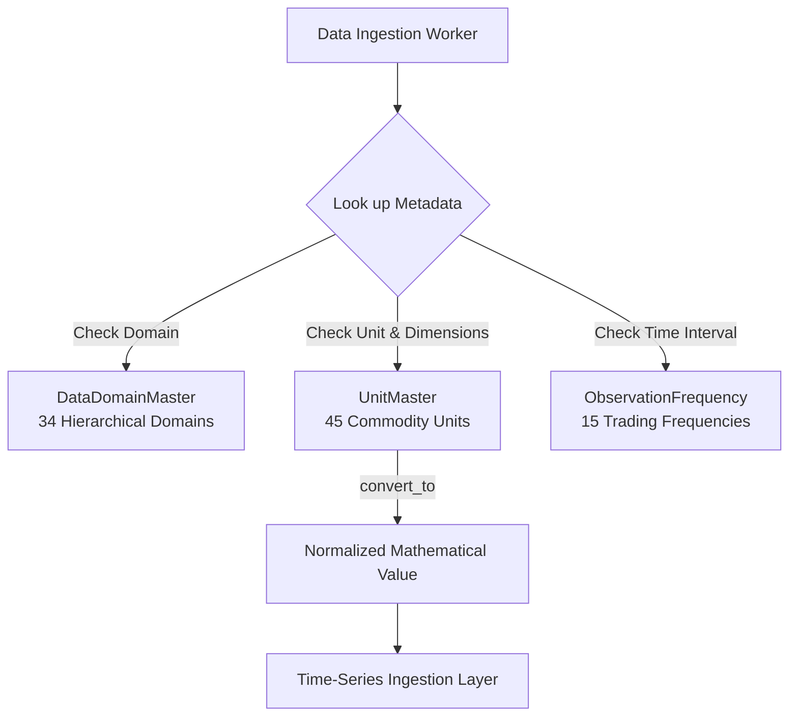

# Commodity Taxonomy, Data Domains & Unit Conversion

The `apps/metadata` module maintains the canonical taxonomy, units of measurement, and frequency definitions for all financial and physical commodity data across the platform.

---

## 1. Module Overview & Purpose

Commodity datasets span widely disparate domains:
- **Physical flows**: Barrels per day, Million Cubic Feet, Metric Tons, Hundredweights (CWT).
- **Price conventions**: USD per barrel, Cents per pound, EUR per MWh, Worldscale points.
- **Time horizons**: Sub-second ticks, 30-minute futures settlement bars, daily spot closes, monthly USDA balance sheets.

Without a centralized, normalized metadata engine, downstream analytics suffer from dimension mismatch errors (e.g. comparing barrels with metric tons without density adjustments) or frequency misalignment.

---

## 2. Architecture & Data Flow



---

## 3. Core Models & Services

### `DataDomainMaster`
Registers all 34 canonical commodity data domains, organized hierarchically:
- **Financial / Trading**: `EXCHANGE_MARKET_DATA`, `FUTURES_CURVES`, `ORDER_BOOK_MICROSTRUCTURE`, `OPTIONS`
- **Physical Fundamentals**: `SUPPLY`, `DEMAND`, `INVENTORIES`, `SUPPLY_DEMAND_BALANCES`
- **Logistics & Infrastructure**: `STORAGE_CAPACITY`, `FREIGHT`, `SHIPPING`, `PORTS`, `PIPELINES`
- **Macro & Policy**: `CFTC_COT`, `MACRO`, `FX`, `INTEREST_RATES`
- **Qualitative & Narratives**: `NEWS`, `GOVERNMENT_REPORTS`, `HISTORICAL_NARRATIVES`

### `UnitMaster` & Conversion Engine
Maintains 45 standard units across Volume, Mass, Energy, Power, and Pricing quotes.

Each unit defines:
- `unit_type`: `VOLUME`, `MASS`, `ENERGY`, `CURRENCY`, `TIME`, `RATIO`
- `base_unit`: Reference unit for that physical dimension (e.g. `BBL` for Volume, `MT` for Mass)
- `conversion_factor`: Exact multiplicative factor to convert to the base unit.

#### Mathematical Conversion:
```python
from apps.metadata.models import UnitMaster
from decimal import Decimal

bcf = UnitMaster.objects.get(code="BCF")
mmcf = UnitMaster.objects.get(code="MMCF")

# Convert 2.5 BCF to MMCF:
result = bcf.convert_to(Decimal("2.5"), mmcf)
# => Decimal('2500.0')
```

---

## 4. How to Extend or Add Units of Measurement

If you need to add a new commodity industry unit (e.g., European Gas Normal Cubic Meters `NCM` or Japanese Yen per Kilo `JPY_KG`):

- **Target File**: `apps/metadata/management/commands/seed_metadata.py`
- **Target Function**: `_seed_units()`

### Extension Contract:
```python
# In apps/metadata/management/commands/seed_metadata.py:

{
    "code": "NCM",
    "name": "Normal Cubic Meter",
    "unit_type": UnitType.VOLUME,
    "symbol": "Nm³",
    "base_unit_code": "M3",                  # Must reference an existing base unit
    "conversion_factor": Decimal("1.0"),     # Multiplier to base unit
    "is_base_unit": False,
    "description": "Standard cubic meter of natural gas at 0°C and 1.01325 bar",
}
```

Run seed command to register:
```bash
python manage.py seed_metadata
```
