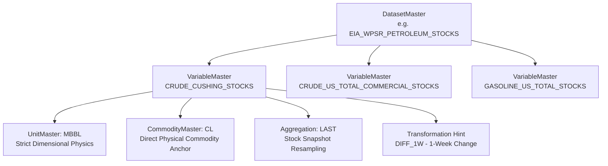

# Variable Master & Metrics Catalog Architecture

The `apps/variables` module establishes the canonical dictionary of standardized economic, physical, and financial time-series variables across global commodity markets.

---

## 1. Domain Concept & Architectural Role

While `apps/datasets` defines the macro data publishing container (e.g. *EIA Weekly Petroleum Status Report*, *USDA WASDE*, *CFTC Commitments of Traders*), financial analysts and quantitative models execute equations, curve math, and regressions on **individual observable variables** (e.g., *Cushing Crude Ending Stocks*, *US Corn Production*, *Commercial Net Positioning*).

Without a canonical Variable Master:
* **Identifier Drift**: Different data providers publish the same metric under radically different column codes (e.g. `CUSH_STK`, `US_CRU_CUSH_W`, `PET_STK_W_CUSH_BBL`).
* **Stock vs. Flow Corruption**: Resampling time series (e.g. downsampling weekly data to monthly) produces invalid arithmetic if stocks are accidentally summed instead of snapshotting the last observation.
* **Dimensional Unit Inconsistencies**: Calculations fail silently when barrels (`BBL`), thousands of barrels (`MBBL`), and millions of barrels (`MMBBL`) are mixed without explicit dimensional enforcement.

`VariableMaster` guarantees:
1. **Semantic Normalization**: Every metric maps to a single canonical code regardless of how upstream vendors label it.
2. **Deterministic Resampling Math**: Aggregation behavior (`LAST`, `SUM`, `AVG`, `MAX`, `MIN`) is explicitly declared on the metric.
3. **Direct Asset Linkage**: Each variable is anchored directly to its physical commodity (`commodity`) and unit of measure (`unit`).



---

## 2. Stock vs. Flow Determinism (`aggregation_method`)

In quantitative commodity economics, time-series metrics fall into two fundamental physical classes:

| Class | Economic Nature | Aggregation Method | Resampling Behavior (e.g. Weekly &rarr; Monthly) | Examples |
| :--- | :--- | :---: | :--- | :--- |
| **Stock** | Instantaneous snapshot of physical inventory or financial state. | `LAST` | Takes the observation at the close of the period (or `AVG` if evaluating monthly average level). Summing is mathematically forbidden. | `CRUDE_CUSHING_STOCKS`, `LME_COPPER_WARRANTS`, `NATGAS_WORKING_STORAGE`, `COT_MANAGED_MONEY_NET`. |
| **Flow** | Cumulative accumulation of volume, production, or movement over time. | `SUM` | Sums all periodic observations across the target interval to calculate total periodic volume. | `WASDE_CORN_US_PRODUCTION`, `USDA_CORN_NET_EXPORT_SALES`, `REFINERY_CRUDE_RUNS`, `TRADING_VOLUME`. |
| **Rate / Index** | Continuous benchmark index, efficiency percentage, or environmental rate. | `AVG` | Computes the arithmetic or time-weighted mean across the period. | `US_REFINERY_UTILIZATION_PCT`, `NOAA_ENSO_ONI_INDEX`, `FX_USD_EUR_SPOT_RATE`, `CROP_CONDITION_GOOD_EXCELLENT`. |
| **Capacity / Limit** | Peak physical limit or maximum permitted pipeline throughput. | `MAX` / `MIN` | Identifies extreme ceiling or floor values across the window. | `PIPELINE_PEAK_CAPACITY`, `MIN_STORAGE_PRESSURE`. |

---

## 3. Data Types & Display Transformations

### Supported Data Types (`VariableDataType`)
* `DECIMAL`: Floating point measurements (e.g. volumes, prices, percentages).
* `INTEGER`: Discrete counts (e.g. active drilling rig count, open contracts).
* `PERCENTAGE_RATIO`: Rates bounded between 0–100 or 0–1 (e.g. refinery utilization, crop condition).
* `BOOLEAN`: Binary flags (e.g. force majeure declared, weather alert active).
* `TEXT`: Categorical or classification labels.

### Default Analytical Transformations (`DisplayTransformation`)
Metrics declare a recommended display transformation for charting consoles and generative LLM prompts:

* `RAW_LEVEL`: The untransformed physical level (e.g. total barrels in storage).
* `DIFF_1W` / `DIFF_1M`: Periodic absolute difference (e.g. weekly storage draw of $-2.5$ MBBL).
* `PCT_CHANGE_YOY`: Year-over-Year percentage change (e.g. annual production growth $+4.2\%$).
* `SPREAD_DIFF`: Basis, crack, or crush spread differential.
* `LOG_RETURN`: Logarithmic change for financial volatility estimation.

---

## 4. Pluggable Catalog Provider Architecture

In accordance with Core Directive #1 (Source Independence), the variable dictionary is decoupled from the application database via the Strategy + Factory pattern:

```python
# apps/variables/providers/base.py
class BaseVariableCatalogProvider(ABC):
    @abstractmethod
    def get_variables(self) -> List[RawVariableSpec]:
        """Fetch all canonical variable specifications."""
        pass

    @abstractmethod
    def get_variable(self, code: str) -> Optional[RawVariableSpec]:
        """Retrieve a single variable specification by code."""
        pass
```

### Static vs Enterprise Catalog Providers
* **`StaticVariableCatalogProvider`**: Standard built-in provider populating 40 institutional benchmark variables across energy, agriculture, metals, weather, positioning, and macro indicators.
* **Custom Enterprise Providers**: External data dictionaries (e.g., Snowflake Data Dictionary, Collibra, or internal quant feature stores) can be plugged in by setting `VARIABLE_CATALOG_PROVIDER` in settings.

---

## 5. Model Reference & Database Tables

### `VariableMaster` (`variables_master`)

| Field | Type | Description |
| :--- | :--- | :--- |
| `id` | `UUID` | Primary key. |
| `code` | `CharField(80)` | Unique canonical metric slug (e.g. `CRUDE_CUSHING_STOCKS`, `WASDE_CORN_US_ENDING_STOCKS`). |
| `name` | `CharField(150)` | Full institutional metric title. |
| `description` | `TextField` | Scope, methodology, and measurement parameters. |
| `dataset` | `ForeignKey` | Parent dataset (`apps.datasets.DatasetMaster`). |
| `domain` | `ForeignKey` | Data domain taxonomy classification (`apps.metadata.DataDomainMaster`). |
| `commodity` | `ForeignKey` | Direct physical commodity anchor (`apps.commodities.CommodityMaster`, optional). |
| `unit` | `ForeignKey` | Physical or financial unit of measure (`apps.metadata.UnitMaster`). |
| `data_type` | `CharField(30)` | Representation type (`DECIMAL`, `INTEGER`, `PERCENTAGE_RATIO`, etc.). |
| `aggregation_method` | `CharField(20)` | Resampling logic (`LAST` for stocks, `SUM` for flows, `AVG` for rates). |
| `seasonal_adjustment`| `CharField(30)` | Adjustment status (`UNADJUSTED` vs `SEASONALLY_ADJUSTED`). |
| `default_transformation` | `CharField(30)` | Preferred display/analytical transformation hint. |
| `is_benchmark` | `BooleanField` | True if this variable is a headline benchmark indicator. |
| `is_active` | `BooleanField` | True if variable is actively observed and ingested. |
| `display_order` | `IntegerField` | Sorting order in dashboards and tables. |

---

## 6. Handling Missing & Unobserved Data (`null` as `NOT_AVAILABLE`)

In commodity markets, data is frequently unobserved due to exchange holidays, delayed government surveys (e.g. USDA or CFTC reporting postponements), vendor API outages, or selective enterprise data licensing (where an institution does not license an expensive proprietary feed such as Argus or Platts).

The platform enforces a strict, high-performance design standard for representing missing or unavailable metric data:

### 1. The Zero-Storage Null Bitmap Standard
Instead of storing redundant string or enum columns (e.g., `VARCHAR(32)` with `"NOT_AVAILABLE"`) across millions or billions of daily and intraday observation rows, missing values are strictly stored as native SQL **`NULL`** (`null=True, blank=True`).

* **Storage Efficiency**: Relational databases (PostgreSQL, SQLite) and columnar analytical formats (Parquet, ClickHouse, DuckDB) store `NULL` values in a compact 1-bit bitmap per column, adding **zero bytes** to table rows.
* **Avoids Table Bloat**: Eliminates 20% to 40% disk bloat that would otherwise be incurred by storing repetitive status strings across massive time series tables.

### 2. C-Speed SIMD Vectorization in Pandas & NumPy
In quantitative research and forward curve modeling, observations are loaded directly into Pandas DataFrames or NumPy arrays:
* A database `NULL` natively maps to IEEE 754 **`np.nan`** (Not a Number) or Polars `null`.
* Standard mathematical operations (`df.ffill()`, `df.interpolate()`, `df.dropna()`, `np.isnan()`) execute in compiled **C/SIMD vectorization**.
* Custom string status codes would require slow Python row-by-row parsing, destroying backtest and curve-building throughput.

### 3. Preserving the Mathematical Boundary: `0.0` vs. `NULL`
In physical commodities, `0.0` is frequently a valid, meaningful observation:
* `0.0` inches of rainfall in an agricultural crop belt.
* `0.0` barrels per day flowing through a closed pipeline interconnect.
* `0.0` crack spread discount during prompt par settlement.

By strictly using `NULL` for missing data, the system mathematically guarantees that unobserved or missing metrics are never conflated with legitimate `0.0` values.

### 4. Dynamic Presentation & LLM Layer Handling
Instead of polluting database tables, semantic unavailability is handled dynamically at the presentation, REST API, and LLM context generation layer:

* **REST API Response**:
  ```json
  {
    "timestamp": "2026-09-22T00:00:00Z",
    "value": null,
    "display": "NOT_AVAILABLE"
  }
  ```
* **LLM Narrative Prompt Builder**:
  When feeding quantitative tables to the narrative reasoning engine, null values are formatted as `NOT_AVAILABLE`:
  ```python
  # Context builder formatting
  val_str = f"{obs.value} {obs.unit.code}" if obs.value is not None else "NOT_AVAILABLE"
  ```
  This guarantees that the AI analyst knows the data is unavailable and explicitly states the gap in research commentary rather than hallucinating numbers.

* **Base Model Contract (`AbstractObservation` in `apps.core.models`)**:
  All future time series models inherit from `AbstractObservation`, which provides:
  - `is_available` (`bool`): Returns `True` if `value is not None`.
  - `display_value` (`str`): Returns formatted number or `"NOT_AVAILABLE"`.

